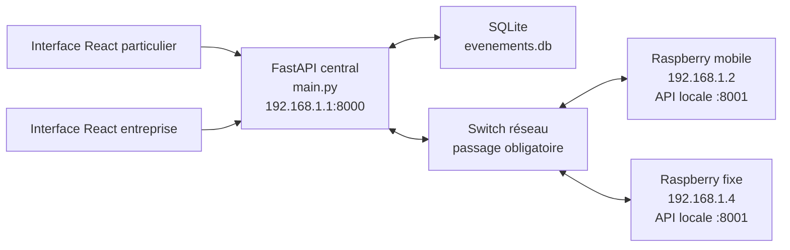
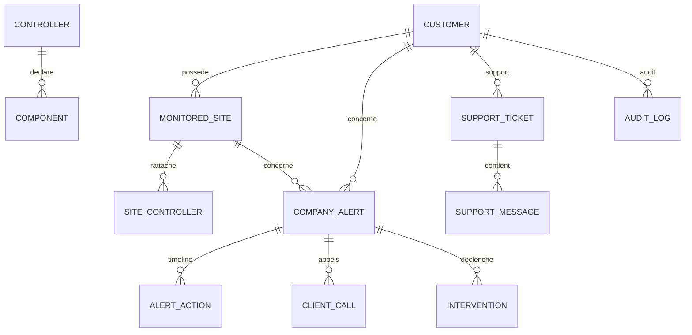
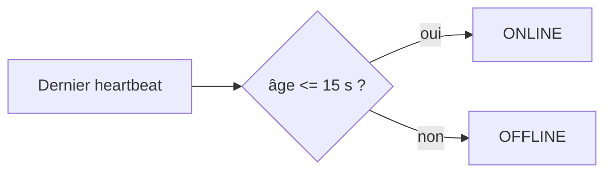
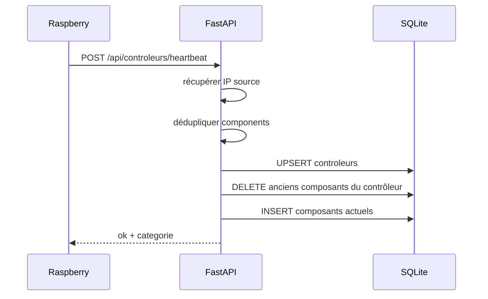
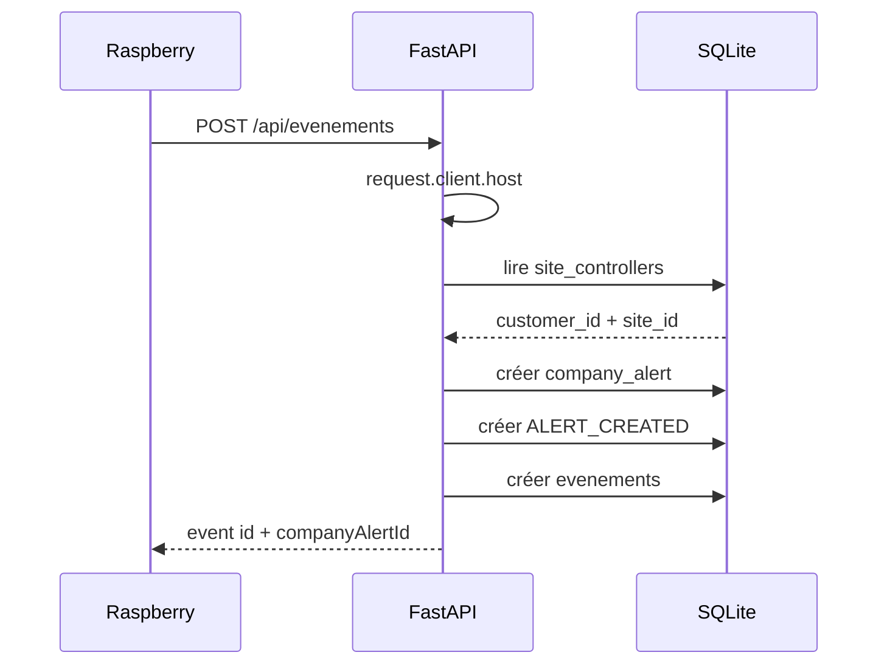
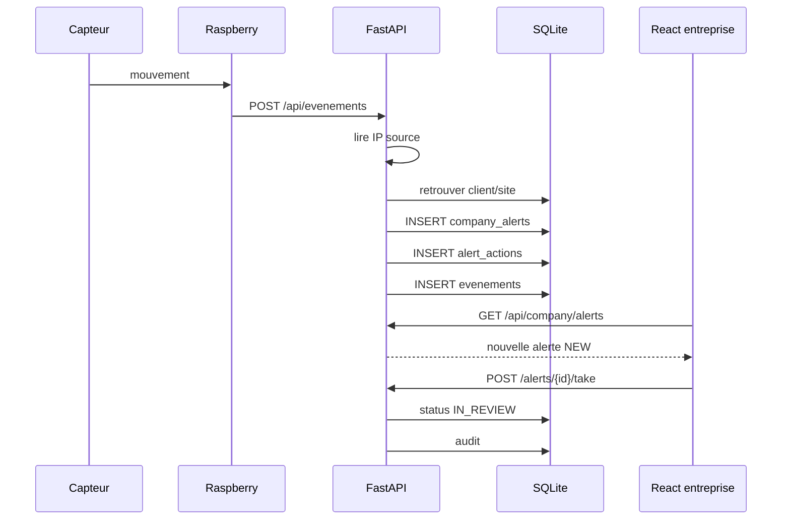
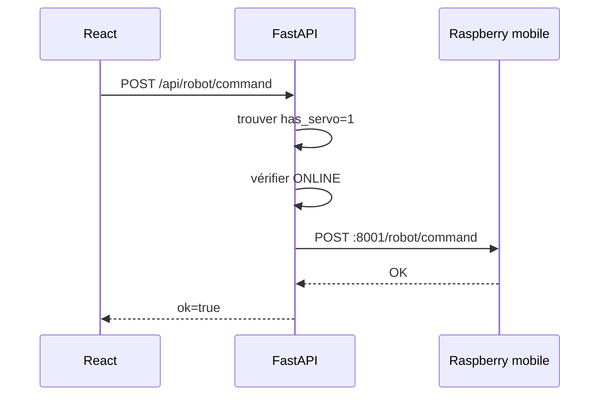
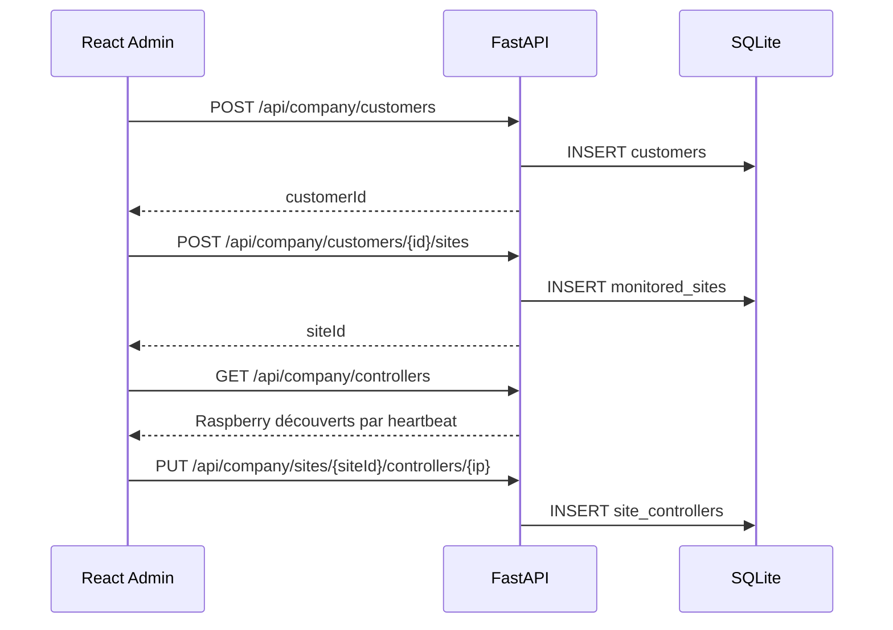
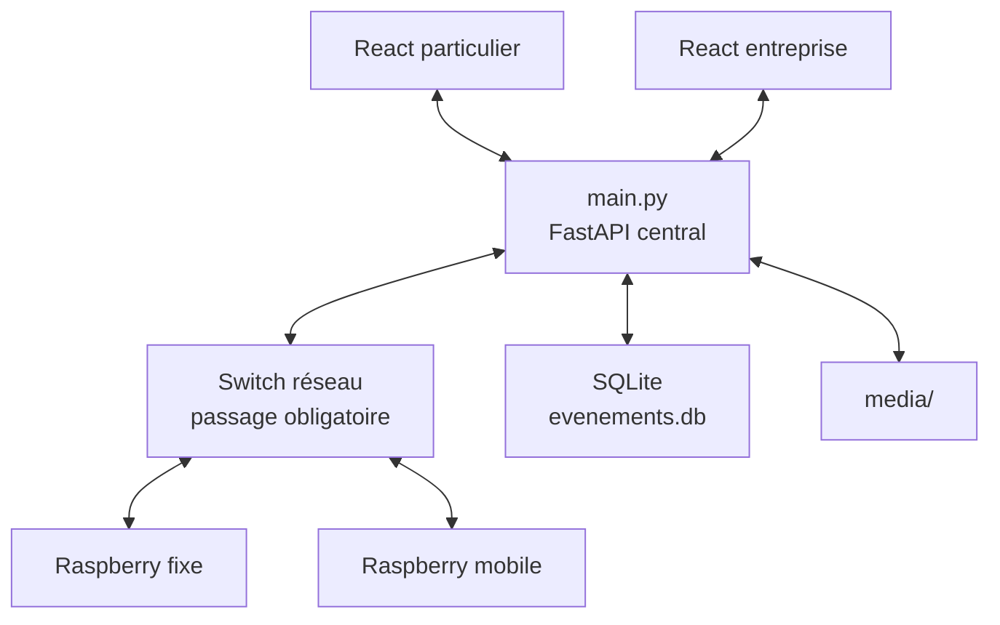

# Atelier Maison — Documentation complète du serveur central `main.py`

> **Document de référence du backend FastAPI du prototype Atelier Maison**  
> Cette documentation décrit le fichier `main.py` actuel **sans le découper en sous-modules**.  
> Elle explique son rôle dans l’architecture, les tables SQLite, les modèles Pydantic, les fonctions utilitaires, les 62 routes HTTP, les échanges avec React et les Raspberry, ainsi que le scénario de test prévu pour l’intégration.

---

# 1. Rôle de `main.py`

`main.py` est actuellement le **serveur central** du prototype Atelier Maison.

Il regroupe dans un seul fichier :

- le serveur HTTP FastAPI ;
- la création et les migrations de la base SQLite ;
- la réception des heartbeats des Raspberry ;
- la réception des événements de surveillance ;
- l’état global armé / désarmé ;
- la gestion des équipements ;
- la communication du serveur vers les Raspberry ;
- le proxy des flux caméra ;
- les captures d’images ;
- la gestion des médias ;
- la commande du robot ;
- l’ancienne commande servo ;
- la logique métier du centre de surveillance ;
- les clients et leurs sites ;
- le rattachement des Raspberry aux clients ;
- les alertes entreprise ;
- les interventions ;
- le support ;
- les commentaires internes ;
- l’audit.

Le fichier est volontairement conservé en un seul bloc pour la version de démonstration `Pour_Lundi`.

---

# 2. Architecture générale

La règle principale du projet est :

```text
React
  ↓
FastAPI central
  ↓
SWITCH
  ↓
Raspberry
```

et dans l’autre sens :

```text
Raspberry
  ↓
SWITCH
  ↓
FastAPI central
  ↓
React
```

Le passage par le **switch est obligatoire pour toute communication entre
le serveur central et les Raspberry**.

Les Raspberry ne communiquent donc jamais directement avec le serveur par
Wi-Fi, hotspot ou liaison parallèle dans l'architecture prévue pour le
prototype de laboratoire.

React ne contacte jamais directement un Raspberry.

## Schéma global



Le switch ne réalise aucun traitement applicatif : il transporte les paquets réseau.

## Règle physique du réseau du prototype

Dans l'installation prévue pour lundi, les deux Raspberry sont reliés au
serveur **uniquement par le switch Ethernet**.

```text
Raspberry fixe ──RJ45──┐
                       │
Raspberry mobile ─RJ45─┼── SWITCH ──RJ45── Serveur FastAPI
                       │
Poste réseau éventuel ─┘
```

Cela signifie :

- aucun Raspberry ne doit utiliser une connexion Wi-Fi directe vers le serveur ;
- aucun Raspberry ne doit utiliser le hotspot du PC pour joindre FastAPI ;
- les requêtes HTTP `Raspberry -> FastAPI` traversent le switch ;
- les requêtes HTTP `FastAPI -> Raspberry:8001` traversent également le switch ;
- le switch reste transparent au niveau applicatif : les programmes utilisent
  toujours les adresses IP, mais physiquement les trames passent par le switch.


---

# 3. Démarrage du serveur

À la fin du fichier :

```python
if __name__ == "__main__":
    import uvicorn

    uvicorn.run(
        app,
        host="0.0.0.0",
        port=8000,
    )
```

`0.0.0.0` est important : FastAPI doit être accessible depuis les autres machines du réseau local.

Le serveur est donc prévu sur :

```text
http://192.168.1.1:8000
```

Swagger :

```text
http://192.168.1.1:8000/docs
```

---

# 4. Dépendances Python

Le fichier utilise :

```text
fastapi
uvicorn
pydantic
python-multipart
```

`python-multipart` est nécessaire pour :

```text
UploadFile
File(...)
```

utilisés par l’image liée à un événement.

Les modules suivants appartiennent à la bibliothèque standard Python :

```text
json
sqlite3
time
uuid
pathlib
urllib
```

Installation possible :

```bash
pip install fastapi uvicorn pydantic python-multipart
```

---

# 5. Configuration

Les principales constantes sont définies au début du fichier.

## Base SQLite

```python
CHEMIN_BASE = Path(__file__).parent / "evenements.db"
```

La base est placée dans le même dossier que `main.py`.

## Ancienne interface statique

```python
DOSSIER_STATIC = Path(__file__).parent / "static"
```

Le serveur conserve l’ancien dossier `static` s’il existe.

Le frontend principal reste toutefois l’application React séparée.

## Médias

```python
DOSSIER_MEDIA = Path(__file__).parent / "media"
```

Ce dossier stocke les captures créées depuis React.

Il est créé automatiquement :

```python
DOSSIER_MEDIA.mkdir(exist_ok=True)
```

## Port API Raspberry

```python
PORT_API_RASPBERRY = 8001
```

Chaque Raspberry doit donc exposer sa propre petite API HTTP sur :

```text
http://IP_RASPBERRY:8001
```

## Seuil OFFLINE

```python
DELAI_OFFLINE_SECONDES = 15
```

Un Raspberry est considéré :

```text
ONLINE  : dernier heartbeat <= 15 secondes
OFFLINE : dernier heartbeat > 15 secondes
```

## Timeout Raspberry

```python
DELAI_REQUETE_RASPBERRY = 3
```

Une commande serveur → Raspberry ne doit pas bloquer plus de 3 secondes.

## Conservation des médias

```python
DUREE_MEDIA_SECONDES = 24 * 60 * 60
```

Une capture non sauvegardée expire après 24 heures.

---

# 6. Base de données

## Fonction `get_connexion()`

Cette fonction ouvre une connexion SQLite.

Elle active :

```python
connexion.row_factory = sqlite3.Row
```

ce qui permet :

```python
ligne["capteur"]
```

au lieu de :

```python
ligne[2]
```

Elle active aussi :

```sql
PRAGMA foreign_keys = ON
```

pour les relations des tables entreprise.

---

# 7. Fonction `initialiser_base()`

Cette fonction est appelée dès le démarrage :

```python
initialiser_base()
```

Elle :

1. crée les tables manquantes ;
2. conserve les données existantes ;
3. effectue certaines migrations ;
4. crée les index utiles.

Elle ne supprime pas la base existante.

---

# 8. Tables SQLite

Le backend utilise actuellement les tables suivantes.

## 8.1 `evenements`

Événements techniques reçus des Raspberry.

```text
id
capteur
zone
horodatage
decision
horodatage_decision
image
source_ip
customer_id
site_id
company_alert_id
```

### Distinction importante

`evenements` représente :

```text
détection technique brute
```

et non directement :

```text
dossier opérationnel du centre de surveillance
```

---

## 8.2 `historique_servo`

Historique de l’ancienne route servo.

```text
id
angle
horodatage
```

---

## 8.3 `controleurs`

Un contrôleur correspond à un Raspberry connu grâce à son heartbeat.

```text
ip
has_servo
derniere_vue
```

`has_servo` est actuellement utilisé pour distinguer :

```text
false → FIXED
true  → MOBILE
```

---

## 8.4 `composants`

Composants déclarés dans le heartbeat d’un Raspberry.

```text
id
ip_controleur
nom
enabled
valeur
derniere_vue
```

Exemples :

```text
camera
motion_sensor
photoresistance
servo
robot
led
button
```

---

## 8.5 `systeme`

État global de surveillance.

```text
id
armed
```

La ligne `id = 1` est créée automatiquement.

---

## 8.6 `media`

Captures créées à la demande depuis React.

```text
id
camera_id
camera_name
kind
created_at
expires_at
saved
filename
```

---

# 9. Tables entreprise

## `company_users`

Prépare les futurs comptes internes :

```text
ADMIN
SUPERVISOR
OPERATOR
FIELD_AGENT
```

L’authentification réelle n’est pas encore implémentée.

---

## `customers`

Clients surveillés.

```text
id
first_name
last_name
email
phone
status
created_at
notes
```

---

## `monitored_sites`

Un client peut avoir plusieurs sites.

```text
id
customer_id
name
address
city
postal_code
country
status
armed
created_at
```

---

## `emergency_contacts`

Contacts d’urgence d’un client.

---

## `site_controllers`

Association :

```text
site surveillé
    ↕
Raspberry
```

Le Raspberry reste identifié par son IP.

Une IP ne peut appartenir qu’à un seul site à la fois.

---

## `company_alerts`

Dossiers métier du centre de surveillance.

```text
source_event_id
customer_id
site_id
source_sensor
source_equipment_id
camera_id
priority
status
outcome
assigned_operator_id
...
```

---

## `alert_actions`

Timeline d’une alerte.

Exemples :

```text
ALERT_CREATED
ALERT_TAKEN
STATUS_CHANGED
CAMERA_VIEWED
SCREENSHOT_TAKEN
ROBOT_COMMAND
CLIENT_CALL
AGENT_DISPATCH
ALERT_RESOLVED
```

---

## `client_calls`

Historique des tentatives d’appel du client.

---

## `company_comments`

Commentaires internes humains.

Ils sont différents des logs d’audit.

---

## `support_tickets`

Tickets support.

---

## `support_messages`

Messages et notes internes d’un ticket.

---

## `field_agents`

Intervenants terrain.

---

## `interventions`

Missions terrain associées à une alerte.

---

## `emergency_escalations`

Trace une demande d’escalade.

Dans le prototype :

> cette table ne déclenche aucun appel réel vers la police ou les services d’urgence.

---

## `audit_logs`

Journal automatique des actions sensibles.

L’audit est écrit côté serveur, pas directement depuis React.

---

# 10. Relation entre les données



---

# 11. Modèles Pydantic — matériel et interface utilisateur

Les modèles Pydantic vérifient automatiquement les JSON reçus.

## `NouvelEvenement`

```text
capteur
zone
horodatage
```

## `Decision`

```text
decision
```

Valeurs utilisées :

```text
fausse_alerte
vraie_alerte
```

## `CommandeServo`

```text
angle
```

## `EtatComposant`

```text
name
enabled
value
```

## `HeartbeatControleur`

```text
has_servo
components[]
```

## `EtatSysteme`

```text
armed
```

## `EtatActivation`

```text
enabled
```

## `CommandeRobot`

```text
command
speed
```

## `EtatMedia`

```text
saved
```

## `MediaItem`

Format envoyé à React pour les captures.

## `Equipement`

Format attendu par le frontend `dashboard.ts`.

---

# 12. Modèles Pydantic — entreprise

## Identité opérateur

```text
IdentiteOperateur
├── operatorId
└── operatorName
```

L’identité actuelle est temporaire car il n’existe pas encore de vraie authentification.

---

## Actions alerte

```text
PriseEnChargeAlerte
ModificationStatutAlerte
AppelClientEntreprise
AffectationIntervenant
EscaladeUrgenceEntreprise
NouvelleCommandeRobotEntreprise
ActivationEquipementEntreprise
NouvelleVueCameraEntreprise
NouvelleCaptureCameraEntreprise
```

---

## Administration

```text
NouveauClientEntreprise
NouveauSiteEntreprise
NouveauContactUrgence
NouveauTicketSupport
NouvelIntervenantEntreprise
NouvelUtilisateurEntreprise
```

---

# 13. Fonctions de formatage

## `date_iso_depuis_timestamp(timestamp)`

Transforme un timestamp Unix en chaîne ISO :

```text
2026-09-06T11:00:00
```

utilisable facilement par JavaScript.

## `date_iso_ou_none(timestamp)`

Même principe, mais accepte `NULL`.

---

# 14. `creer_identifiant_equipement(ip, nom)`

Exemple :

```text
192.168.1.4 + camera
```

devient :

```text
192-168-1-4-camera
```

Ce format est utilisé comme `equipmentId`.

---

# 15. `statut_controleur(derniere_vue)`

Calcule :

```text
ONLINE
OFFLINE
```

à partir du dernier heartbeat.



---

# 16. `type_composant(nom, categorie)`

Convertit le nom technique Raspberry vers les types React.

| Nom Raspberry | Type React |
|---|---|
| `camera` sur fixe | `CAMERA` |
| `camera` sur mobile | `ROBOT_CAMERA` |
| `motion_sensor` / `motion` / `pir` | `MOTION_SENSOR` |
| `photoresistance` / `light_sensor` | `PHOTORESISTOR` |
| `button` / `bouton` | `BUTTON` |
| `led` | `LED` |
| `servo` | `SERVO` |
| `robot` | `ROBOT` |
| autre | `OTHER` |

---

# 17. `nom_affichable()`

Transforme les noms techniques en noms compréhensibles par l’utilisateur.

Exemple :

```text
motion_sensor
→
Capteur de mouvement
```

---

# 18. Communication serveur central → Raspberry

Fonction principale :

```python
envoyer_json_au_raspberry(...)
```

Elle construit :

```text
http://{ip}:8001{chemin}
```

et utilise `urllib.request`.

Exemple :

```text
FastAPI
  ↓
Switch
  ↓
PUT http://192.168.1.4:8001/components/camera/enabled
```

En cas de timeout / erreur :

```text
HTTP 502
```

est renvoyé à React.

---

# 19. Lecture des équipements

## `lire_equipement_sql(identifiant)`

Lit :

```text
composant
+
informations de son Raspberry
```

avec un `JOIN`.

Si l’équipement n’existe pas :

```text
404
```

---

## `construire_equipement(ligne, ordre)`

Transforme une ligne SQLite en objet consommable par React.

Cette fonction détermine notamment :

```text
kind
status
groupKind
streamUrl
```

Important :

```text
streamUrl
=
/api/cameras/{equipmentId}/stream
```

React reçoit donc une URL FastAPI et non une URL Raspberry.

---

# 20. Nettoyage des médias

## `nettoyer_medias_expires()`

Supprime :

```text
média non sauvegardé
+
date d'expiration dépassée
```

de SQLite et du disque.

---

# 21. Fonctions entreprise de sérialisation

Le fichier contient plusieurs fonctions qui transforment une ligne SQLite en JSON frontend :

```text
client_depuis_ligne()
site_depuis_ligne()
contact_urgence_depuis_ligne()
alerte_entreprise_depuis_ligne()
action_alerte_depuis_ligne()
commentaire_depuis_ligne()
ticket_support_depuis_ligne()
message_support_depuis_ligne()
intervenant_depuis_ligne()
intervention_depuis_ligne()
escalade_depuis_ligne()
audit_depuis_ligne()
utilisateur_entreprise_depuis_ligne()
```

Elles jouent le rôle de « traducteurs » entre :

```text
noms SQL snake_case
```

et :

```text
noms JSON camelCase utilisés par React
```

Exemple :

```text
first_name
→
firstName
```

---

# 22. Fonctions de vérification

```text
verifier_client_existe()
verifier_site_existe()
verifier_alerte_entreprise_existe()
verifier_ticket_support_existe()
```

Elles évitent de dupliquer partout le même code 404.

---

# 23. `lire_rattachement_ip()`

Fonction essentielle.

Elle réalise :

```text
IP du Raspberry
      ↓
site_controllers
      ↓
monitored_sites
      ↓
customer
```

Le Raspberry ne connaît donc jamais :

```text
customerId
siteId
```

C’est le serveur qui réalise l’association.

---

# 24. `recalculer_statuts_sites()`

Recalcule :

```text
ONLINE
DEGRADED
OFFLINE
```

selon les Raspberry rattachés.

Règles :

```text
aucun Raspberry        → OFFLINE
tous ONLINE            → ONLINE
mélange ONLINE/OFFLINE → DEGRADED
tous OFFLINE           → OFFLINE
```

---

# 25. Priorité automatique des événements

Fonction :

```text
determiner_priorite_evenement()
```

Règles actuelles du prototype :

```text
panic / urgence / bouton → CRITICAL
mouvement / caméra / PIR → HIGH
autre                    → MEDIUM
```

Cette logique reste volontairement simple et explicable.

---

# 26. Timeline et audit

## `creer_action_alerte_sql()`

Ajoute une étape à la timeline d’une alerte.

## `creer_audit_sql()`

Ajoute une trace automatique dans `audit_logs`.

Différence :

```text
AlertAction
→ histoire d'un dossier d'alerte particulier

AuditLog
→ journal transversal de l'entreprise
```

---

# 27. Statistiques client

Fonction :

```text
calculer_statistiques_client(customer_id, period)
```

Périodes :

```text
7D
30D
90D
1Y
```

Elle calcule réellement depuis SQLite :

```text
totalDetections
totalAlerts
confirmedAlerts
falseAlarms
averageTakeoverTimeSeconds
averageResolutionTimeSeconds
clientCalls
fieldInterventions
emergencyEscalations
supportTickets
resolvedSupportTickets
dailyActivity
```

La disponibilité globale reste :

```text
systemAvailabilityPercent = None
```

tant qu’un historique fiable de heartbeat n’est pas conservé.

---

# 28. Création de l’application FastAPI

```python
app = FastAPI(
    title="Serveur central Atelier Maison"
)
```

Puis :

```python
initialiser_base()
```

La base est donc préparée automatiquement au démarrage.

---

# 29. CORS

FastAPI autorise notamment :

```text
http://localhost:5173
http://127.0.0.1:5173
http://192.168.x.x:...
```

Cela permet les tests :

```text
PC
téléphone
réseau local
```

Le frontend utilise cependant principalement le proxy Vite `/api`.

---

# 30. Ancienne interface statique

Si :

```text
static/index.html
```

existe, la route :

```text
GET /
```

la renvoie.

Sinon :

```json
{
  "status": "serveur central Atelier Maison actif",
  "api": "/api"
}
```

---

# 31. Inventaire complet des routes

Le fichier actuel expose **62 routes FastAPI**.

---

# 32. Santé

| Méthode | Route | Fonction |
|---|---|---|
| GET | `/` | `page_accueil()` |
| GET | `/api/health` | `health()` |
| GET | `/api/company/health` | `company_health()` |

---

# 33. Servo historique

| Méthode | Route | Fonction |
|---|---|---|
| POST | `/api/servo` | `commander_servo()` |
| GET | `/api/servo` | `lire_commande_servo()` |
| GET | `/api/servo/historique` | `historique_servo()` |

`angle_servo` est actuellement une variable Python en mémoire.

L’historique des changements est stocké dans SQLite.

---

# 34. Heartbeat Raspberry

```http
POST /api/controleurs/heartbeat
```

Fonction :

```text
heartbeat_controleur()
```

Le Raspberry envoie :

```json
{
  "has_servo": false,
  "components": [
    {
      "name": "camera",
      "enabled": true,
      "value": null
    }
  ]
}
```

FastAPI récupère l’IP avec :

```python
request.client.host
```

## Traitement



Le heartbeat représente donc l’état matériel courant.

---

# 35. Système armé / désarmé

## Lecture

```http
GET /api/system
```

## Modification

```http
PUT /api/system
```

Payload :

```json
{
  "armed": true
}
```

Le serveur :

1. récupère les Raspberry ;
2. vérifie qu’ils sont online ;
3. appelle `/system` sur chacun ;
4. seulement si cela réussit, met à jour SQLite.

---

# 36. Équipements

## Liste

```http
GET /api/equipements
```

Cette route construit dynamiquement les équipements depuis :

```text
controleurs
+
composants
```

## Activation

```http
PUT /api/equipements/{identifiant}/enabled
```

Le serveur appelle ensuite :

```text
PUT http://Raspberry:8001/components/{name}/enabled
```

Puis met à jour SQLite.

---

# 37. Robot

```http
POST /api/robot/command
```

Commandes autorisées :

```text
FORWARD
BACKWARD
LEFT
RIGHT
STOP
```

Vitesse :

```text
0..100
```

Le serveur choisit le Raspberry :

```text
has_servo = 1
```

le plus récemment vu.

Il lui envoie :

```http
POST /robot/command
```

sur le port 8001.

---

# 38. Flux caméra

```http
GET /api/cameras/{camera_id}/stream
```

FastAPI :

1. retrouve la caméra ;
2. vérifie son type ;
3. vérifie Raspberry online ;
4. vérifie caméra enabled ;
5. ouvre :

```text
http://IP:8001/camera/stream?name=...
```

6. relaie les octets vers React avec `StreamingResponse`.

## Schéma

```text
Navigateur
   ↓
FastAPI /api/cameras/.../stream
   ↓
Switch
   ↓
Raspberry :8001/camera/stream
   ↓
Switch
   ↓
FastAPI
   ↓
Navigateur
```

---

# 39. Capture caméra

```http
POST /api/cameras/{camera_id}/screenshot
```

FastAPI appelle :

```text
POST http://IP:8001/camera/screenshot
```

puis :

```text
image
  ↓
media/
  +
table media
```

La capture reçoit :

```text
expiresAt = création + 24 h
saved = false
```

---

# 40. Médias

Routes :

```text
GET /api/media
PUT /api/media/{media_id}/saved
GET /api/media/files/{filename}
```

La lecture de fichier utilise :

```python
Path(filename).name
```

pour éviter de sortir du dossier `media`.

---

# 41. Création d’un événement

```http
POST /api/evenements
```

Fonction :

```text
creer_evenement()
```

Payload historique conservé :

```json
{
  "capteur": "motion_sensor",
  "zone": "salon",
  "horodatage": 1788680000
}
```

Le Raspberry n’envoie pas le client.

FastAPI récupère :

```text
source_ip
```

puis cherche le rattachement.

---

# 42. Création automatique de l’alerte entreprise

Si l’IP appartient à un site :



Si aucun rattachement n’existe :

```text
événement technique enregistré
companyAlertId = null
```

Aucun faux client n’est créé.

---

# 43. Décisions événement utilisateur

Routes :

```text
GET  /api/evenements/{id}/decision
POST /api/evenements/{id}/decision
```

Décisions acceptées :

```text
fausse_alerte
vraie_alerte
```

---

# 44. Image directement attachée à un événement

Routes :

```text
POST /api/evenements/{id}/image
GET  /api/evenements/{id}/image
```

Ici l’image est stockée :

```text
dans SQLite
colonne evenements.image
```

Cela est différent des captures React de `media/`.

---

# 45. Liste et suppression événements

```text
GET    /api/evenements
DELETE /api/evenements/{id}
DELETE /api/evenements
```

La liste n’inclut volontairement pas le BLOB `image`.

---

# 46. Utilisateurs entreprise

```text
GET  /api/company/users
POST /api/company/users
```

Rôles autorisés :

```text
ADMIN
SUPERVISOR
OPERATOR
FIELD_AGENT
```

Cette partie prépare l’authentification future.

---

# 47. Création client

```http
POST /api/company/customers
```

Crée un client `ACTIVE`.

---

# 48. Création site

```http
POST /api/company/customers/{customer_id}/sites
```

Un nouveau site commence :

```text
status = OFFLINE
armed = false
```

jusqu’à ce que du matériel soit rattaché.

---

# 49. Contacts d’urgence

```http
POST /api/company/customers/{customer_id}/emergency-contacts
```

La priorité doit être >= 1.

---

# 50. Contrôleurs entreprise

## Liste globale

```http
GET /api/company/controllers
```

Retourne tous les Raspberry connus par heartbeat.

Chaque entrée contient :

```text
ip
controllerType
hasServo
status
lastSeen
assigned
siteId
siteName
customerId
customerName
components[]
```

C’est la route utilisée par le formulaire React « Nouveau client ».

---

# 51. `construire_controleur_entreprise()`

Construit l’objet Raspberry complet pour React.

Le frontend peut donc afficher :

```text
Raspberry fixe
192.168.1.4
ONLINE
├── camera
└── motion_sensor
```

---

# 52. Rattachement Raspberry → site

```http
PUT /api/company/sites/{site_id}/controllers/{controller_ip}
```

Le backend refuse un Raspberry inconnu.

Il faut donc avoir reçu au moins un heartbeat.

Si l’IP était déjà attribuée ailleurs, elle est déplacée vers le nouveau site.

---

# 53. Liste des Raspberry d’un site

```http
GET /api/company/sites/{site_id}/controllers
```

Retourne :

```text
Raspberry
+
components
+
client
+
site
```

pour la fiche client React.

---

# 54. Intervenants

Création :

```text
POST /api/company/agents
```

Liste :

```text
GET /api/company/agents
```

Statut initial :

```text
AVAILABLE
```

---

# 55. Création ticket support

```http
POST /api/company/support
```

Catégories autorisées :

```text
CAMERA
ROBOT
SENSOR
NETWORK
ACCOUNT
ALERT
OTHER
```

Priorités :

```text
LOW
MEDIUM
HIGH
CRITICAL
```

Une trace d’audit `SUPPORT_TICKET_CREATED` est créée.

---

# 56. Dashboard entreprise

```http
GET /api/company/dashboard
```

Calcule depuis SQLite :

```text
activeAlerts
criticalAlerts
alertsWaitingForOperator
monitoredCustomers
monitoredSites
onlineEquipments
offlineEquipments
availableAgents
activeInterventions
openSupportTickets
averageAlertTakeoverTimeSeconds
```

Aucune valeur opérationnelle n’est inventée.

---

# 57. Liste des alertes entreprise

```http
GET /api/company/alerts
```

Filtres possibles :

```text
status
priority
customerId
search
```

Tri :

```text
CRITICAL
HIGH
MEDIUM
LOW
```

puis date décroissante.

---

# 58. Fiche d’alerte

```http
GET /api/company/alerts/{alert_id}
```

Retourne :

```text
alert
customer
site
actions
comments
interventions
emergencyEscalation éventuelle
```

---

# 59. Timeline alerte

```http
GET /api/company/alerts/{alert_id}/actions
```

Retourne `AlertAction[]`.

---

# 60. Prise en charge

```http
POST /api/company/alerts/{alert_id}/take
```

Effets :

```text
status → IN_REVIEW
assigned_operator_id → opérateur
AlertAction → ALERT_TAKEN
AuditLog → ALERT_STATUS_CHANGED
```

---

# 61. Changement de statut alerte

```http
PUT /api/company/alerts/{alert_id}/status
```

Statuts autorisés :

```text
NEW
IN_REVIEW
CLIENT_CONTACT
FALSE_ALARM
CONFIRMED
ESCALATED
AGENT_DISPATCHED
RESOLVED
```

`outcome` conserve la conclusion :

```text
FALSE_ALARM
CONFIRMED
```

même après `RESOLVED`.

---

# 62. Appel client

```http
POST /api/company/alerts/{alert_id}/client-call
```

Résultats :

```text
ANSWERED
NO_ANSWER
UNAVAILABLE
FALSE_ALARM_CONFIRMED
SUSPICIOUS_SITUATION_CONFIRMED
```

Effets :

```text
client_calls
status CLIENT_CONTACT
AlertAction CLIENT_CALL
Audit CLIENT_CALLED
```

---

# 63. Affectation d’un intervenant

```http
POST /api/company/alerts/{alert_id}/dispatch
```

Conditions :

```text
agent existe
agent status = AVAILABLE
```

Effets :

```text
création interventions
agent → DISPATCHED
alerte → AGENT_DISPATCHED
outcome → CONFIRMED
timeline
audit
```

---

# 64. Escalade urgence

```http
POST /api/company/alerts/{alert_id}/emergency-escalation
```

Effets :

```text
emergency_escalations
alerte → ESCALATED
outcome → CONFIRMED
AlertAction POLICE_ESCALATION
Audit POLICE_ESCALATION_REQUESTED
```

Important :

> aucune communication réelle avec la police n’est effectuée.

---

# 65. Clients

```text
GET /api/company/customers
GET /api/company/customers/{customer_id}
```

La liste accepte :

```text
search
status
```

---

# 66. Fiche client complète

```http
GET /api/company/customers/{customer_id}
```

Retourne :

```text
customer
sites
emergencyContacts
recentAlerts
alertHistory
activityHistory
supportTickets
comments
statistics
```

La fiche React complète encore les sites avec :

```text
GET /api/company/sites/{siteId}/controllers
```

pour afficher l’installation physique.

---

# 67. Historique et statistiques client

```text
GET /api/company/customers/{id}/alerts
GET /api/company/customers/{id}/activity
GET /api/company/customers/{id}/statistics
```

Période statistique par défaut :

```text
30D
```

---

# 68. Commentaires

```text
GET  /api/company/comments
POST /api/company/comments
```

Cibles possibles :

```text
ALERT
CUSTOMER
SUPPORT_TICKET
```

Un commentaire sur une alerte crée aussi :

```text
AlertAction COMMENT_ADDED
```

Tous les commentaires créent une trace d’audit.

---

# 69. Support

```text
GET  /api/company/support
GET  /api/company/support/{ticket_id}
POST /api/company/support/{ticket_id}/messages
PUT  /api/company/support/{ticket_id}/status
```

Statuts :

```text
NEW
IN_PROGRESS
WAITING_CUSTOMER
RESOLVED
CLOSED
```

Les messages peuvent être :

```text
internal = false → réponse support
internal = true  → note interne
```

---

# 70. Interventions

```http
GET /api/company/interventions
```

Filtre optionnel :

```text
customerId
```

Le workflow complet de changement d’état terrain n’est pas encore exposé par des routes dédiées.

---

# 71. Audit

```http
GET /api/company/audit
```

Filtre optionnel :

```text
customerId
```

Sans filtre :

```text
1000 dernières entrées maximum
```

---

# 72. Actions matérielles auditées de l’entreprise

Le centre de surveillance n’utilise pas seulement les routes matérielles générales.

Il possède des wrappers qui permettent de rattacher l’action à une alerte et de l’auditer.

---

# 73. Consultation caméra entreprise

```http
POST /api/company/alerts/{alert_id}/cameras/{camera_id}/view
```

Cette route :

1. vérifie l’alerte ;
2. vérifie que l’équipement est une caméra ;
3. crée `CAMERA_VIEWED` ;
4. crée `CAMERA_VIEW_STARTED` dans l’audit ;
5. renvoie `streamUrl`.

Elle n’ouvre pas elle-même le flux : le navigateur utilise ensuite l’URL retournée.

---

# 74. Screenshot entreprise

```http
POST /api/company/alerts/{alert_id}/cameras/{camera_id}/screenshot
```

La route appelle la vraie fonction :

```text
capture_camera()
```

Puis crée :

```text
AlertAction SCREENSHOT_TAKEN
Audit SCREENSHOT_CREATED
```

---

# 75. Commande robot entreprise

```http
POST /api/company/alerts/{alert_id}/robot-command
```

Elle réutilise :

```text
commander_robot()
```

Puis ajoute :

```text
AlertAction ROBOT_COMMAND
Audit ROBOT_COMMAND_SENT
```

---

# 76. Activation équipement entreprise

```http
PUT /api/company/alerts/{alert_id}/equipments/{equipment_id}/enabled
```

Elle réutilise :

```text
modifier_equipement()
```

Puis crée :

```text
EQUIPMENT_ENABLED
ou
EQUIPMENT_DISABLED
```

dans l’audit.

---

# 77. Flux complet : mouvement → console entreprise



---

# 78. Flux complet : React → robot



Dans le centre entreprise :

```text
React
→ /api/company/alerts/{id}/robot-command
→ commander_robot()
→ Raspberry
→ audit
```

---

# 79. Flux complet : caméra

```text
React
  ↓
GET /api/cameras/{cameraId}/stream
  ↓
FastAPI
  ↓
Switch
  ↓
GET Raspberry:8001/camera/stream
  ↓
Switch
  ↓
StreamingResponse FastAPI
  ↓
React
```

---

# 80. Flux complet : création client et installation



---

# 81. Flux page Infrastructure React

Avec le backend actuel :

```text
CompanyInfrastructurePage
        ↓
GET /api/company/controllers
        ↓
controleurs + composants
        ↓
ONLINE / OFFLINE
```

Le statut est déterminé par heartbeat.

Important :

```text
OFFLINE
```

ne prouve pas automatiquement :

```text
câble physiquement débranché
```

Cela signifie seulement que la communication récente est perdue.

Pour une vraie télémétrie du lien Ethernet, il faudra enrichir plus tard le backend et/ou utiliser un switch administrable ou une liaison de secours.

---

# 82. Gestion des erreurs HTTP

Le backend utilise plusieurs codes :

```text
400 → requête matériel incohérente
404 → ressource introuvable
409 → conflit d'état
422 → validation métier
502 → Raspberry / service aval inaccessible
503 → système indisponible / Raspberry offline
```

Pydantic peut également produire automatiquement un `422` lorsqu’un payload ne correspond pas au modèle.

---

# 83. Ce qui est persistant

Stocké dans SQLite :

```text
événements
clients
sites
Raspberry connus
composants
alertes
timeline
support
interventions
audit
servo historique
médias metadata
```

Stocké dans le dossier `media` :

```text
captures de caméra
```

---

# 84. Ce qui n’est pas réellement implémenté

Pour présenter le prototype correctement :

## Authentification

Pas encore de véritable login backend.

## Session opérateur

`operatorId` et `operatorName` viennent encore du frontend.

## Appel police

L’escalade est uniquement enregistrée.

## État physique exact du câble

Le serveur sait détecter la perte de heartbeat mais ne possède pas encore une preuve physique fiable d’un câble retiré.

## Historique de disponibilité

La disponibilité statistique globale n’est pas calculée.

## Cycle complet intervention

La création existe ; toutes les transitions terrain ne sont pas encore exposées.

---

# 85. Sécurité et précautions

## Ne pas exposer le serveur sur Internet

Cette version est prévue pour un réseau local de prototype.

## Pas d’authentification

Les routes entreprise ne doivent pas être considérées comme sécurisées pour une production réelle.

## Fichiers à ne pas versionner

Éviter de pousser :

```text
evenements.db
media/
__pycache__/
*.pyc
.env.local
```

La base peut contenir des données de test et les médias sont générés à l’exécution.

---

# 86. Fichiers attendus autour de `main.py`

Une organisation simple pour la branche de démonstration :

```text
Atelier_MAISON/
├── application-web/
│   └── ...
│
├── files/
│   ├── main.py
│   ├── evenements.db        # local, idéalement ignoré par Git
│   ├── media/               # généré, idéalement ignoré par Git
│   └── static/              # ancienne interface si conservée
│
├── README_REACT_ATELIER_MAISON.md
└── README_MAIN_PY.md
```

---

# 87. Tests minimaux avant la démonstration

## Vérifier la syntaxe

```bash
python -m py_compile main.py
```

## Lancer

```bash
python main.py
```

## Health

```text
GET http://192.168.1.1:8000/api/health
GET http://192.168.1.1:8000/api/company/health
```

Réponses attendues :

```json
{
  "status": "ok"
}
```

et :

```json
{
  "ok": true
}
```

---

# 88. Vérifications Raspberry

Après démarrage des Raspberry :

```text
GET /api/equipements
GET /api/company/controllers
```

Les deux contrôleurs doivent apparaître.

Configuration prévue :

```text
192.168.1.2 → MOBILE
192.168.1.4 → FIXED
```

La classification dépend toutefois de `has_servo`, pas d’une IP codée dans le backend.

---

# 89. Test bout en bout recommandé

```text
1. lancer FastAPI
2. démarrer Raspberry fixe
3. démarrer Raspberry mobile
4. vérifier heartbeats
5. GET /api/company/controllers
6. créer client
7. créer site
8. rattacher les deux Raspberry
9. provoquer mouvement
10. vérifier événement
11. vérifier CompanyAlert
12. prendre alerte en charge
13. ouvrir caméra
14. capture
15. robot FORWARD
16. robot STOP
17. vérifier audit
```

---

# 90. Diagnostic rapide

## React reçoit 502 sur `/api/company/health`

Probable :

```text
Vite ne parvient pas à joindre FastAPI
```

Vérifier :

```text
serveur lancé
IP 192.168.1.1
port 8000
proxy Vite
switch
pare-feu
```

## FastAPI fonctionne mais Raspberry offline

Vérifier :

```text
heartbeat
IP Raspberry
réseau
programme Raspberry
```

## Raspberry ONLINE mais commande 502

Vérifier l’API locale :

```text
http://IP:8001
```

et les routes :

```text
/system
/components/...
/camera/...
/robot/command
```

---

# 91. Swagger comme outil de test

FastAPI génère automatiquement :

```text
/docs
```

Swagger permet de tester :

```text
création client
création site
rattachement Raspberry
création agent
ticket support
actions alertes
```

sans devoir modifier manuellement SQLite.

---

# 92. Pourquoi conserver `main.py` unique pour `Pour_Lundi`

Le fichier est très long, mais pour la branche de démonstration il présente un avantage :

```text
une seule version du backend à synchroniser
```

Le refactor en plusieurs fichiers pourra être effectué après validation du prototype.

Pour `Pour_Lundi`, l’objectif prioritaire est :

```text
stabilité du contrat HTTP
+
intégration complète
+
test matériel
```

plutôt qu’une réorganisation interne de dernière minute.

---

# 93. Création de la branche Git `Pour_Lundi`

Depuis la racine du dépôt :

```powershell
git status
```

Vérifier d’abord les fichiers présents.

Créer ensuite :

```powershell
git switch -c Pour_Lundi
```

Vérifier :

```powershell
git branch --show-current
```

Résultat attendu :

```text
Pour_Lundi
```

---

# 94. Avant de préparer le commit

Vérifier le `.gitignore`.

Il devrait au minimum ignorer :

```gitignore
# Base générée localement
files/evenements.db

# Médias générés
files/media/

# Python
__pycache__/
*.pyc

# React local
application-web/.env.local
application-web/node_modules/
application-web/dist/
```

Ne jamais pousser de secret dans Git.

---

# 95. Ajouter les fichiers de manière contrôlée

Éviter de faire directement :

```text
git add .
```

sans avoir regardé le dépôt.

Commencer par :

```powershell
git status --short
```

Puis ajouter les dossiers source réellement voulus, par exemple :

```powershell
git add application-web
git add files/main.py
git add README_REACT_ATELIER_MAISON.md
git add README_MAIN_PY.md
git add .gitignore
```

Si d’autres fichiers source du dossier `files/` doivent être conservés, les ajouter explicitement.

Puis :

```powershell
git status --short
git diff --cached --stat
```

---

# 96. Commit

Exemple :

```powershell
git commit -m "feat: prepare Atelier Maison integration for Monday"
```

---

# 97. Push GitHub

```powershell
git push -u origin Pour_Lundi
```

La branche distante deviendra :

```text
origin/Pour_Lundi
```

---

# 98. Vérification après push

```powershell
git status
```

Puis sur GitHub :

```text
branche → Pour_Lundi
```

Vérifier notamment la présence de :

```text
application-web/
files/main.py
README_REACT_ATELIER_MAISON.md
README_MAIN_PY.md
```

et l’absence de :

```text
evenements.db
node_modules
.env.local
media
```

---

# 99. Résumé du rôle de `main.py`

```text
main.py
│
├── initialise SQLite
│
├── reçoit les heartbeats Raspberry
│
├── construit les équipements
│
├── reçoit les détections
│
├── crée les alertes entreprise
│
├── sert les données React
│
├── transmet les commandes matériel
│
├── proxifie les flux caméra
│
├── sauvegarde les captures
│
├── gère clients/sites
│
├── gère support/interventions
│
└── journalise les actions sensibles
```

---

# 100. Résumé architectural final



`main.py` est donc actuellement le **pivot de toute l’architecture Atelier Maison**.

La branche `Pour_Lundi` conserve volontairement ce serveur central monolithique afin de limiter les risques de régression avant l’intégration matérielle.
