# Atelier Maison — Documentation complète du frontend React

> **Version documentée : prototype d’intégration du 6 septembre 2026**  
> **Objectif de la prochaine intégration : lundi 7 septembre 2026**  
> Cette documentation décrit **le fonctionnement actuel du frontend React**, son architecture réseau, ses fichiers, ses fonctions, ses types, ses appels HTTP, ses flux de données et les contrats attendus du serveur FastAPI et des Raspberry.

---

# 1. Objectif général du frontend

Le frontend `application-web` est l’interface du système de surveillance **Atelier Maison**.

Il contient deux interfaces distinctes :

1. **Espace particulier**  
   destiné à la personne dont le logement est surveillé ;

2. **Espace entreprise / centre de surveillance**  
   destiné aux opérateurs Atelier Maison.

Les deux interfaces utilisent **le même serveur central FastAPI**, mais elles n’utilisent pas les mêmes contextes React ni les mêmes routes métier.

Le frontend ne dialogue **jamais directement avec un Raspberry**.

La règle d’architecture est :

```text
React
  ↓
Vite /api
  ↓
FastAPI central
  ↓
Raspberry
```

et dans l’autre sens :

```text
Raspberry
  ↓
FastAPI central
  ↓
React
```

Le serveur central est donc le **point de passage obligatoire** entre l’interface et le matériel.

---

# 2. Architecture réseau actuelle

## 2.1 Topologie de laboratoire

La configuration prévue pour l’intégration est actuellement :

```text
Raspberry mobile
192.168.1.2
      │
      │ Ethernet
      │
      ▼
┌────────────────────────────────────────────┐
│                  SWITCH                    │
└────────────────────────────────────────────┘
      ▲                ▲                 ▲
      │                │                 │
      │                │                 │
192.168.1.4      192.168.1.1       PC React/Vite
Raspberry fixe   Serveur FastAPI   réseau Ethernet
```

Le PC React peut également partager un point d’accès Wi-Fi Windows :

```text
Téléphone
192.168.137.x
      │
      │ Wi-Fi
      ▼
PC React / Vite
192.168.137.1:5173
      │
      │ Ethernet
      ▼
FastAPI
192.168.1.1:8000
```

Le téléphone ne doit donc pas avoir à joindre directement `192.168.1.1`.

---

## 2.2 Rôle du switch

Le switch n’exécute **aucune logique métier**.

Il ne :

- traite pas les alertes ;
- n’héberge pas l’API ;
- ne décide pas quel Raspberry utiliser ;
- ne stocke aucune donnée.

Il transporte uniquement les paquets réseau entre les machines.

Le cerveau central est **FastAPI**.

---

# 3. Pourquoi Vite sert de proxy

Le navigateur utilise une URL relative :

```text
/api/...
```

et non :

```text
http://192.168.1.1:8000/api/...
```

Cette configuration est définie dans :

```text
.env.local
```

avec :

```env
VITE_API_BASE_URL=/api
API_PROXY_TARGET=http://192.168.1.1:8000
```

Le fichier :

```text
vite.config.ts
```

intercepte toutes les requêtes commençant par `/api` et les transfère vers FastAPI.

## Schéma

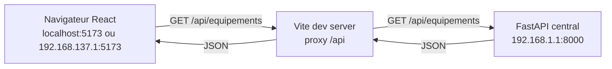

Cela présente plusieurs avantages :

- aucune IP du serveur dans les pages React ;
- le téléphone utilise la même application ;
- les URLs des caméras peuvent également passer par Vite ;
- la logique réseau reste centralisée dans `vite.config.ts`.

---

# 4. Variables d’environnement

Fichier :

```text
.env.local
```

## `VITE_API_BASE_URL`

```env
VITE_API_BASE_URL=/api
```

Cette variable est accessible au code exécuté dans le navigateur.

Elle est utilisée par :

```text
src/services/systemApi.ts
src/services/companyApi.ts
```

## `API_PROXY_TARGET`

```env
API_PROXY_TARGET=http://192.168.1.1:8000
```

Cette variable est uniquement lue par :

```text
vite.config.ts
```

Elle ne commence volontairement pas par `VITE_`, afin de ne pas être injectée dans le JavaScript du navigateur.

> `.env.local` est une configuration locale. Il ne faut pas y ajouter de secret et il ne faut pas coder les IP des Raspberry dans React.

---

# 5. Technologies utilisées

Le projet utilise principalement :

| Technologie | Rôle |
|---|---|
| React 19 | composants et état de l’interface |
| TypeScript | typage des données et contrats |
| React Router | navigation entre les pages |
| Vite | serveur de développement, build et proxy |
| Lucide React | icônes |
| Recharts | graphiques de statistiques |
| CSS | mise en page desktop/mobile |
| FastAPI | serveur central, hors frontend |
| SQLite | persistance serveur, hors frontend |

Le projet n’utilise actuellement ni Redux ni autre store global externe.

Les deux stores globaux sont implémentés avec les **Context API React** :

```text
SystemProvider
CompanyProvider
```

---

# 6. Commandes principales du projet

Depuis :

```text
application-web/
```

installer les dépendances :

```bash
npm install
```

lancer le serveur de développement :

```bash
npm run dev
```

vérifier TypeScript :

```bash
npx tsc -b
```

faire le build :

```bash
npm run build
```

lancer ESLint :

```bash
npm run lint
```

prévisualiser un build :

```bash
npm run preview
```

---

# 7. Point d’entrée React

## Fichier : `src/main.tsx`

C’est le premier fichier React exécuté.

Il :

1. cherche `<div id="root">` dans `index.html` ;
2. crée la racine React avec `createRoot()` ;
3. installe `BrowserRouter` ;
4. rend `<App />`.

Structure :

```tsx
<StrictMode>
  <BrowserRouter>
    <App />
  </BrowserRouter>
</StrictMode>
```

## Important : `StrictMode`

En développement, React `StrictMode` peut effectuer un cycle supplémentaire de montage / démontage pour détecter des effets secondaires incorrects.

Conséquence pratique :

> certains `useEffect()` peuvent apparaître deux fois dans les logs de développement.

Donc deux requêtes identiques visibles lors du démarrage ne signifient pas obligatoirement qu’il y a un bug réseau.

En build de production, ce comportement de vérification supplémentaire n’est pas appliqué de la même façon.

---

# 8. Routage général

## Fichier : `src/App.tsx`

`App.tsx` définit toutes les routes.

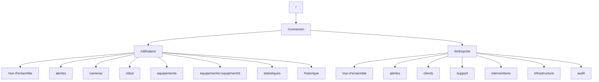

## Routes espace particulier

```text
/utilisateur
/utilisateur/alertes
/utilisateur/cameras
/utilisateur/robot
/utilisateur/equipements
/utilisateur/equipements/:equipmentId
/utilisateur/statistiques
/utilisateur/historique
```

Toutes ces routes sont placées sous :

```tsx
<SystemProvider>
  <UserLayout />
</SystemProvider>
```

## Routes espace entreprise

```text
/entreprise
/entreprise/alertes
/entreprise/clients
/entreprise/support
/entreprise/interventions
/entreprise/infrastructure
/entreprise/audit
```

Toutes ces routes sont placées sous :

```tsx
<CompanyProvider>
  <CompanyLayout />
</CompanyProvider>
```

---

# 9. Architecture logicielle du frontend

Le projet suit volontairement plusieurs couches.

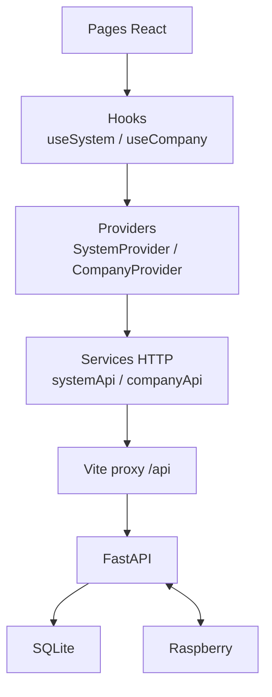

## Responsabilité de chaque couche

### Pages

Les pages :

- affichent les données ;
- gèrent les champs de formulaires ;
- déclenchent les fonctions du contexte ;
- ne doivent pas connaître l’adresse IP du serveur ;
- ne doivent pas appeler les Raspberry.

### Hooks

```text
useSystem()
useCompany()
```

Ils donnent un accès simple et sécurisé aux contextes.

### Providers

Ils :

- conservent l’état global ;
- appellent les services HTTP ;
- transforment certaines réponses ;
- gèrent les chargements ;
- gèrent les erreurs ;
- synchronisent les pages.

### Services HTTP

Ils sont les seuls endroits où sont centralisés les appels `fetch()`.

### Types

Ils définissent le contrat TypeScript entre FastAPI et React.

---

# 10. Arborescence du code React

```text
src/
├── main.tsx
├── App.tsx
├── index.css
├── App.css
│
├── types/
│   ├── dashboard.ts
│   └── company.ts
│
├── services/
│   ├── systemApi.ts
│   └── companyApi.ts
│
├── contexts/
│   ├── system-context.ts
│   ├── SystemProvider.tsx
│   ├── company-context.ts
│   └── CompanyProvider.tsx
│
├── hooks/
│   ├── useSystem.ts
│   └── useCompany.ts
│
├── components/
│   ├── NetworkIncidentModal.tsx
│   │
│   ├── user/
│   │   ├── UserLayout.tsx
│   │   ├── CameraViewer.tsx
│   │   ├── EquipmentControl.tsx
│   │   └── MetricCard.tsx
│   │
│   └── company/
│       └── CompanyLayout.tsx
│
├── pages/
│   ├── LoginPage.tsx
│   │
│   ├── UserDashboardPage.tsx
│   ├── UserAlertsPage.tsx
│   ├── UserCamerasPage.tsx
│   ├── UserRobotPage.tsx
│   ├── UserEquipmentPage.tsx
│   ├── UserEquipmentDetailPage.tsx
│   ├── UserStatisticspage.tsx
│   ├── UserHistoryPage.tsx
│   │
│   ├── CompanyDashboardPage.tsx
│   ├── CompanyAlertsPage.tsx
│   ├── CompanyCustomersPage.tsx
│   ├── CompanySupportPage.tsx
│   ├── CompanyInterventionsPage.tsx
│   ├── CompanyInfrastructurePage.tsx
│   └── CompanyAuditPage.tsx
│
└── styles/
    ├── login.css
    ├── dashboard.css
    ├── user-dashboard.css
    ├── equipment-control.css
    ├── statistics-page.css
    ├── history-page.css
    ├── system-connection.css
    ├── company-layout.css
    ├── company-dashboard.css
    ├── company-alerts.css
    ├── company-customers.css
    ├── company-support.css
    ├── company-interventions.css
    ├── company-infrastructure.css
    └── company-audit.css
```

---

# 11. Page d’entrée

## Fichier : `src/pages/LoginPage.tsx`

Malgré son nom, `LoginPage` **n’effectue actuellement aucune authentification**.

Le backend ne possède pas encore de route :

```text
/api/auth/login
```

La page sert donc uniquement de sélecteur de prototype :

```text
Ouvrir l’espace particulier
Ouvrir le centre de surveillance
```

Les boutons font simplement :

```text
navigate('/utilisateur')
navigate('/entreprise')
```

## Limitation actuelle

Il n’existe :

- ni session ;
- ni token ;
- ni mot de passe vérifié ;
- ni autorisation basée sur les rôles.

L’authentification est une évolution future.

---

# 12. Types de l’espace particulier

## Fichier : `src/types/dashboard.ts`

Ce fichier ne contient **aucune logique**.

Il décrit les données attendues depuis FastAPI.

## `EquipmentKind`

```text
CAMERA
ROBOT_CAMERA
PHOTORESISTOR
MOTION_SENSOR
BUTTON
LED
SERVO
ROBOT
OTHER
```

## `EquipmentGroupKind`

```text
FIXED
MOBILE
```

Le serveur déduit actuellement :

```text
has_servo = false → FIXED
has_servo = true  → MOBILE
```

## `Equipment`

Un équipement contient notamment :

```text
id
name
location
controllerId
kind
status
enabled
controllable
value
lastSeen
groupId
groupName
groupDescription
groupKind
streamUrl
parentDeviceId
```

### Point essentiel

`controllerId` peut correspondre à l’IP du Raspberry, mais React ne doit jamais l’utiliser pour lancer directement une requête vers ce Raspberry.

## `BackendEvent`

Format des événements de surveillance :

```text
id
capteur
zone
horodatage
decision
horodatage_decision
```

Décisions :

```text
en_attente
fausse_alerte
vraie_alerte
```

## `SecurityAlert`

Structure simplifiée utilisée dans l’espace particulier pour l’alerte active.

## `MediaItem`

Capture ou vidéo :

```text
id
cameraId
cameraName
kind
createdAt
expiresAt
saved
mediaUrl
```

## `ServerConnection`

État de communication React ↔ serveur :

```text
CHECKING
CONNECTED
DISCONNECTED
```

## `NetworkIncident`

Décrit une coupure détectée et permet de savoir si l’utilisateur a fermé la popup.

---

# 13. `systemApi.ts` — API de l’espace particulier

## Fichier : `src/services/systemApi.ts`

Règle :

> aucune page utilisateur ne doit faire de `fetch()` directement.

Exemple :

```text
UserDashboardPage
      ↓
useSystem()
      ↓
SystemProvider
      ↓
getSystemState()
      ↓
systemApi.ts
      ↓
GET /api/system
```

## Fonctions internes

### `buildUrl(path)`

Transforme :

```text
/system
```

en :

```text
/api/system
```

### `serverResourceUrl(value)`

Transforme une URL relative renvoyée par FastAPI en URL de même origine que le navigateur.

Exemple PC :

```text
/api/cameras/abc/stream
→
http://localhost:5173/api/cameras/abc/stream
```

Exemple téléphone :

```text
/api/cameras/abc/stream
→
http://192.168.137.1:5173/api/cameras/abc/stream
```

### `buildHeaders()`

Ajoute :

```http
Content-Type: application/json
```

uniquement quand une requête possède un body.

### `readErrorDetail()`

Tente de lire :

```json
{
  "detail": "..."
}
```

renvoyé par FastAPI.

### `requestJson<T>()`

Fonction générique utilisée pour toutes les requêtes JSON.

Elle :

1. construit l’URL ;
2. log la requête ;
3. appelle `fetch()` ;
4. détecte erreur réseau / HTTP ;
5. parse le JSON ;
6. retourne le type `T`.

### `requestAction()`

Utilisée pour les routes qui doivent répondre :

```json
{
  "ok": true
}
```

---

# 14. Appels HTTP de `systemApi.ts`

| Fonction React | Méthode | Route FastAPI | But |
|---|---:|---|---|
| `pingServer()` | GET | `/api/health` | vérifier le serveur |
| `getSystemState()` | GET | `/api/system` | lire surveillance armée/désarmée |
| `setSecurityArmed()` | PUT | `/api/system` | armer/désarmer |
| `getEquipments()` | GET | `/api/equipements` | lire le parc matériel |
| `setEquipmentEnabled()` | PUT | `/api/equipements/{id}/enabled` | activer/désactiver |
| `getEvents()` | GET | `/api/evenements` | lire les détections |
| `sendEventDecision()` | POST | `/api/evenements/{id}/decision` | vraie/fausse alerte |
| `deleteEvent()` | DELETE | `/api/evenements/{id}` | supprimer un événement |
| `clearEvents()` | DELETE | `/api/evenements` | vider l’historique technique |
| `sendRobotMovement()` | POST | `/api/robot/command` | commander le robot |
| `requestScreenshot()` | POST | `/api/cameras/{id}/screenshot` | capture réelle |
| `getMedia()` | GET | `/api/media` | lire captures/vidéos |
| `setMediaSaved()` | PUT | `/api/media/{id}/saved` | conserver un média |

Le flux vidéo lui-même est ensuite chargé par la balise `` avec `streamUrl`.

---

# 15. `SystemProvider.tsx`

## Fichier : `src/contexts/SystemProvider.tsx`

C’est le cœur de l’espace particulier.

Il possède les états globaux :

```text
isArmed
equipment
rawEvents
activeAlert
media
history
statistics
statisticsLoading
feedback
isLoading
dataError
serverConnection
networkIncident
```

## Fonctions de transformation

### `formatUnixDate()`

Convertit un timestamp Unix en date française lisible.

### `currentDateTime()`

Retourne l’heure actuelle utilisée pour les états de connexion.

### `eventTitle()`

Détermine un titre d’historique selon la décision :

```text
vraie_alerte  → Vraie alerte confirmée
fausse_alerte → Fausse alerte confirmée
en_attente    → Alerte en attente
```

### `eventStatus()`

Transforme l’événement en niveau visuel.

### `toHistoryEvent()`

Convertit un `BackendEvent` en `HistoryEvent`.

### `toSecurityAlert()`

Convertit un événement `en_attente` en alerte utilisateur active.

> **Limitation actuelle :** cette transformation ne renseigne pas encore `cameraId`.  
> La page `UserAlertsPage` sait afficher une caméra si une `cameraId` existe, mais le `SecurityAlert` construit actuellement côté React ne contient pas cette association. La console entreprise, elle, peut recevoir `cameraId` dans `CompanyAlert`.

### `buildStatistics()`

Calcule localement les statistiques à partir de `rawEvents`.

Pour une période `7D`, `30D` ou `90D` :

- `detections` = nombre d’événements ;
- `alertes` = événements dont `decision === 'vraie_alerte'` ;
- temps de réponse = `horodatage_decision - horodatage`.

La disponibilité réseau n’est volontairement **pas inventée** :

```text
availabilityActivity = []
```

tant qu’il n’existe pas un véritable historique de heartbeat exploitable.

---

# 16. Polling de l’espace particulier

`SystemProvider` appelle `refreshSystemData()`.

Cette fonction lance en parallèle :

```text
GET /api/system
GET /api/equipements
GET /api/evenements
GET /api/media
```

avec `Promise.all()`.

## Schéma

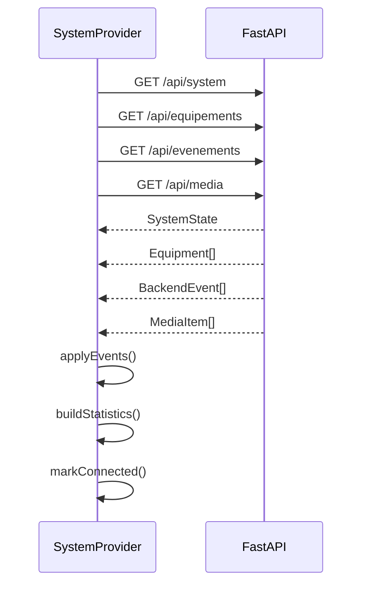

Cette lecture est exécutée :

- au premier montage ;
- puis toutes les **2 secondes**.

```text
setInterval(..., 2000)
```

Cela permet à l’interface particulier de refléter rapidement :

- une nouvelle détection ;
- un Raspberry hors ligne ;
- un changement d’équipement ;
- un média nouvellement créé.

---

# 17. Gestion des coupures utilisateur

## Fonctions importantes

### `markConnected()`

Place :

```text
serverConnection.status = CONNECTED
```

et remet le compteur d’échecs à zéro.

### `markDisconnected(reason)`

Place :

```text
DISCONNECTED
```

et crée un incident réseau.

### `updateEquipmentIncident(equipments)`

Cherche les contrôleurs dont au moins un équipement apparaît `OFFLINE`.

S’il existe des contrôleurs hors ligne, un incident est créé.

### `checkServerConnection()`

Appelle réellement :

```text
GET /api/health
```

### `restoreConnection()`

Séquence complète :

```text
1. GET /api/health
2. si OK :
   GET /api/system
   GET /api/equipements
   GET /api/evenements
   GET /api/media
3. seulement si ces données fonctionnent :
   état CONNECTED
```

---

# 18. `NetworkIncidentModal.tsx`

Fichier :

```text
src/components/NetworkIncidentModal.tsx
```

Cette popup s’affiche lorsqu’un incident réel existe.

Elle ne considère jamais qu’une connexion est rétablie simplement parce que l’utilisateur ferme la popup.

Bouton :

```text
Vérifier à nouveau
```

→ appelle `restoreConnection()`.

La fermeture appelle :

```text
dismissNetworkIncident()
```

et masque seulement la popup.

`UserLayout` conserve parallèlement une bannière persistante tant que le serveur est réellement `DISCONNECTED`.

---

# 19. Hook `useSystem.ts`

Fichier :

```text
src/hooks/useSystem.ts
```

Il encapsule :

```ts
useContext(SystemContext)
```

Si un composant appelle `useSystem()` hors de `<SystemProvider>`, il provoque volontairement une erreur explicite :

```text
useSystem doit être utilisé dans un SystemProvider.
```

C’est une protection contre une mauvaise arborescence React.

---

# 20. `system-context.ts`

Ce fichier définit le **contrat public** du `SystemProvider`.

Les pages peuvent utiliser notamment :

```text
refreshSystemData()
checkServerConnection()
restoreConnection()
dismissNetworkIncident()
clearFeedback()
answerAlert()
loadStatistics()
toggleSecuritySystem()
toggleEquipment()
sendRobotCommand()
takeScreenshot()
toggleMediaSaved()
```

---

# 21. Layout utilisateur

## Fichier : `src/components/user/UserLayout.tsx`

`UserLayout` fournit :

- sidebar ;
- navigation ;
- topbar ;
- état serveur ;
- bannière de coupure ;
- feedback ;
- `<Outlet />` React Router ;
- `NetworkIncidentModal`.

Navigation :

```text
Vue d'ensemble
Alertes
Caméra fixe
Robot caméra
Équipements
Statistiques
Historique
```

---

# 22. `UserDashboardPage.tsx`

Page :

```text
/utilisateur
```

Elle lit :

```text
activeAlert
equipment
isArmed
serverConnection
statistics
toggleSecuritySystem
```

Fonctions principales :

- compte les équipements `ONLINE` ;
- détecte l’alerte active ;
- affiche état global de protection ;
- permet d’armer/désarmer ;
- trouve dynamiquement les caméras fixes ;
- trouve le système mobile via la présence du `SERVO` ;
- affiche un aperçu des statistiques.

Aucun ID d’équipement n’est codé en dur.

---

# 23. `UserAlertsPage.tsx`

Page :

```text
/utilisateur/alertes
```

Elle :

- affiche l’alerte actuellement `en_attente` ;
- affiche zone, heure et capteur ;
- recherche une caméra si `activeAlert.cameraId` existe ;
- gère un échec de flux vidéo ;
- propose un lien vers la page caméra ou robot correspondante.

Aucune décision vidéo supplémentaire n’est simulée.

---

# 24. `CameraViewer.tsx`

Composant réutilisable pour les flux caméra.

Il :

1. trouve la caméra dans `equipment` ;
2. vérifie :
   - serveur connecté ;
   - caméra `ONLINE` ;
   - caméra `enabled` ;
3. affiche `streamUrl` dans `` ;
4. détecte `onError` du flux ;
5. permet :
   - capture ;
   - activation/désactivation.

Pour MJPEG, une balise `` suffit.

---

# 25. `UserCamerasPage.tsx`

Page :

```text
/utilisateur/cameras
```

Elle trouve dynamiquement tous les équipements :

```text
kind === CAMERA
```

Elle permet de sélectionner la caméra via :

```text
?camera={cameraId}
```

Exemple :

```text
/utilisateur/cameras?camera=192-168-1-4-camera
```

Elle affiche aussi les médias liés à la caméra.

S’il existe une caméra robot, un raccourci vers `/utilisateur/robot` est affiché.

---

# 26. `UserRobotPage.tsx`

Page :

```text
/utilisateur/robot
```

Le système mobile n’est pas repéré avec une IP fixe.

Il est repéré par :

```text
kind === SERVO
```

Le `SERVO` sert actuellement de représentant du groupe `MOBILE`.

La caméra robot est cherchée :

1. par `parentDeviceId` si disponible ;
2. sinon par le même `groupId`.

Commandes envoyées :

```text
FORWARD
BACKWARD
LEFT
RIGHT
STOP
```

avec :

```text
speed: 0..100
```

Le mouvement n’est autorisé que si :

```text
serveur CONNECTED
robot ONLINE
robot enabled
caméra ONLINE
caméra enabled
```

---

# 27. `UserEquipmentPage.tsx`

Page :

```text
/utilisateur/equipements
```

Elle récupère l’ensemble du tableau `equipment`.

Elle :

- compte les équipements online ;
- compte les équipements actifs ;
- regroupe les équipements par installation ;
- utilise les informations :
  - `groupId`
  - `groupName`
  - `groupDescription`
  - `groupKind`
- affiche chaque appareil via `EquipmentControl`.

---

# 28. `EquipmentControl.tsx`

Carte réutilisable d’un équipement.

Elle affiche :

- icône selon `EquipmentKind` ;
- nom ;
- localisation ;
- connexion ;
- dernière activité ;
- valeur de capteur éventuelle ;
- état actif/désactivé ;
- bouton détails ;
- switch d’activation si contrôlable.

Commande impossible si :

```text
equipment.status === OFFLINE
ou
equipment.controllable === false
ou
serverConnection !== CONNECTED
```

---

# 29. `UserEquipmentDetailPage.tsx`

Route :

```text
/utilisateur/equipements/:equipmentId
```

Elle utilise `useParams()` pour récupérer `equipmentId`.

Elle retrouve ensuite dynamiquement l’équipement dans `SystemProvider`.

La page affiche :

- informations détaillées ;
- état connexion ;
- état activation ;
- participation éventuelle à la détection ;
- groupe parent ;
- caméra associée ;
- informations robot si nécessaire.

---

# 30. `UserStatisticspage.tsx`

Route :

```text
/utilisateur/statistiques
```

Périodes :

```text
7D
30D
90D
```

Elle appelle :

```text
loadStatistics(period)
```

mais le calcul est local dans `SystemProvider` à partir des événements déjà récupérés.

Graphiques Recharts :

- activité/détections ;
- alertes ;
- disponibilité si elle existe.

Indicateurs :

- total détections ;
- total alertes ;
- taux d’alertes ;
- temps moyen de réponse ;
- disponibilité moyenne si disponible ;
- jour le plus actif.

---

# 31. `UserHistoryPage.tsx`

Route :

```text
/utilisateur/historique
```

L’historique est construit depuis `BackendEvent[]`.

Catégories prévues :

```text
ALERT
COMMAND
SYSTEM
MEDIA
```

La page propose :

- recherche texte ;
- filtre par catégorie ;
- tableau desktop ;
- cartes mobiles.

---

# 32. `MetricCard.tsx`

Petit composant de présentation utilisé pour éviter de recopier plusieurs fois la même structure de KPI.

Il reçoit :

```text
label
value
detail
tone
icon
```

---

# 33. Types de l’espace entreprise

## Fichier : `src/types/company.ts`

Ce fichier décrit le métier du centre de surveillance.

## Relations métier principales

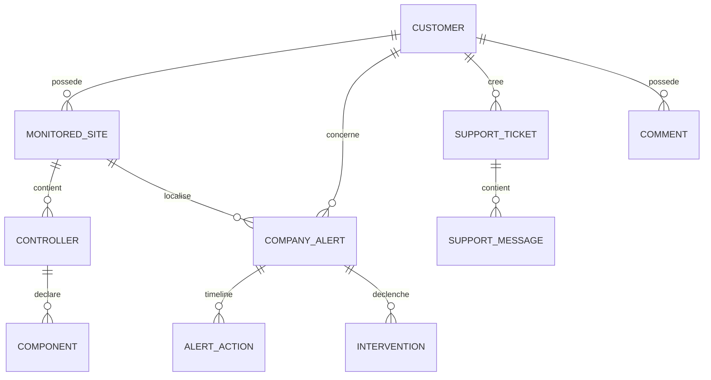

---

# 34. `Customer`

Un client possède :

```text
id
firstName
lastName
email
phone
status
createdAt
notes
```

Statuts :

```text
ACTIVE
SUSPENDED
INACTIVE
```

---

# 35. `MonitoredSite`

Un client peut avoir plusieurs sites.

Exemple :

```text
Mme Dupont
├── Résidence principale
└── Résidence secondaire
```

Un site contient :

```text
id
customerId
name
address
city
postalCode
country
status
armed
createdAt
controllers
```

---

# 36. `CompanyController`

Dans le modèle entreprise, un `CompanyController` correspond à un Raspberry.

```text
CompanyController
├── ip
├── controllerType
├── hasServo
├── status
├── lastSeen
├── assigned
├── siteId
├── customerId
└── components[]
```

Types :

```text
FIXED
MOBILE
```

Statuts :

```text
ONLINE
OFFLINE
```

## Composants

Chaque Raspberry peut déclarer plusieurs :

```text
CompanyControllerComponent
```

avec :

```text
id
controllerIp
name
kind
enabled
value
status
lastSeen
```

---

# 37. Structure installation client

Le formulaire `Nouveau client` produit :

```text
CreateCustomerInstallationInput
├── customer
├── site
└── controllerIps[]
```

Le frontend ne code aucune IP en dur.

Les `controllerIps` viennent de :

```text
GET /api/company/controllers
```

---

# 38. `CompanyAlert`

Une `CompanyAlert` n’est pas la même chose qu’un `BackendEvent`.

## Événement technique

```text
BackendEvent
```

= donnée brute reçue d’un Raspberry.

## Alerte entreprise

```text
CompanyAlert
```

= dossier opérationnel créé pour le centre de surveillance.

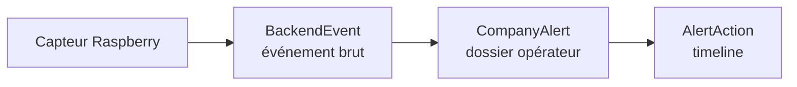

Statuts alerte :

```text
NEW
IN_REVIEW
CLIENT_CONTACT
FALSE_ALARM
CONFIRMED
ESCALATED
AGENT_DISPATCHED
RESOLVED
```

Priorités :

```text
LOW
MEDIUM
HIGH
CRITICAL
```

---

# 39. `AlertAction`

Une action constitue la timeline d’une alerte.

Types possibles :

```text
ALERT_CREATED
ALERT_TAKEN
STATUS_CHANGED
CAMERA_VIEWED
SCREENSHOT_TAKEN
ROBOT_COMMAND
CLIENT_CALL
EMERGENCY_CONTACT_CALL
POLICE_ESCALATION
AGENT_DISPATCH
COMMENT_ADDED
ALERT_RESOLVED
```

Exemple :

```text
08:32 Détection reçue
08:33 Alerte prise en charge
08:34 Caméra consultée
08:35 Client appelé
08:36 Intervenant envoyé
```

---

# 40. Audit vs commentaire

Ils sont volontairement séparés.

## Commentaire

Contenu humain :

```text
"Le client est à l'étranger cette semaine."
```

## Audit

Trace automatique :

```text
actor = Opérateur Atelier Maison
action = CAMERA_VIEW_STARTED
resource = alert-123
date = ...
```

Le frontend **ne possède aucune fonction permettant de créer arbitrairement un AuditLog**.

L’audit doit être généré par FastAPI lors des actions sensibles.

---

# 41. `companyApi.ts`

Fichier :

```text
src/services/companyApi.ts
```

Il applique la même règle que `systemApi.ts` :

> les pages ne font jamais directement `fetch()`.

Schéma :

```text
CompanyAlertsPage
      ↓
useCompany()
      ↓
CompanyProvider
      ↓
takeCompanyAlert()
      ↓
companyApi.ts
      ↓
POST /api/company/alerts/{id}/take
```

Il contient également :

```text
buildUrl()
serverResourceUrl()
buildQuery()
buildHeaders()
readErrorDetail()
requestJson()
requestAction()
```

---

# 42. Identité opérateur temporaire

L’authentification entreprise n’existant pas encore, certaines actions envoient temporairement :

```json
{
  "operatorId": "demo-operator",
  "operatorName": "Opérateur Atelier Maison"
}
```

Cette identité est définie dans :

```text
src/contexts/CompanyProvider.tsx
```

constante :

```text
TEMPORARY_OPERATOR
```

Elle sert à rendre les timelines et audits testables avant l’authentification réelle.

---

# 43. Appels HTTP entreprise — dashboard et alertes

| Fonction | Méthode | Route |
|---|---:|---|
| `getCompanyDashboardStatistics()` | GET | `/api/company/dashboard` |
| `getCompanyAlerts()` | GET | `/api/company/alerts` |
| `getCompanyAlert()` | GET | `/api/company/alerts/{alertId}` |
| `takeCompanyAlert()` | POST | `/api/company/alerts/{alertId}/take` |
| `updateCompanyAlertStatus()` | PUT | `/api/company/alerts/{alertId}/status` |
| `getAlertActions()` | GET | `/api/company/alerts/{alertId}/actions` |
| `registerClientCall()` | POST | `/api/company/alerts/{alertId}/client-call` |
| `dispatchFieldAgent()` | POST | `/api/company/alerts/{alertId}/dispatch` |
| `requestEmergencyEscalation()` | POST | `/api/company/alerts/{alertId}/emergency-escalation` |

`getAlertActions()` existe dans le service mais la fiche complète renvoie déjà les actions ; cette fonction reste disponible pour une lecture dédiée ultérieure.

---

# 44. Actions matérielles entreprise auditées

Ces routes sont différentes des routes génériques utilisateur.

Pourquoi ?

Parce que le backend doit :

1. effectuer l’action réelle ;
2. savoir dans quelle alerte elle a été effectuée ;
3. écrire la timeline ;
4. écrire l’audit.

## Caméra

```text
openCompanyAlertCamera()
POST /api/company/alerts/{alertId}/cameras/{cameraId}/view
```

Réponse attendue :

```json
{
  "ok": true,
  "streamUrl": "/api/cameras/.../stream"
}
```

## Capture

```text
takeCompanyAlertScreenshot()
POST /api/company/alerts/{alertId}/cameras/{cameraId}/screenshot
```

## Robot

```text
sendCompanyAlertRobotCommand()
POST /api/company/alerts/{alertId}/robot-command
```

Payload :

```json
{
  "operatorId": "demo-operator",
  "operatorName": "Opérateur Atelier Maison",
  "command": "FORWARD",
  "speed": 50
}
```

## Activation d’équipement

```text
setCompanyAlertEquipmentEnabled()
PUT /api/company/alerts/{alertId}/equipments/{equipmentId}/enabled
```

---

# 45. Appels HTTP entreprise — clients et installations

| Fonction | Méthode | Route |
|---|---:|---|
| `getCustomers()` | GET | `/api/company/customers` |
| `createCustomer()` | POST | `/api/company/customers` |
| `createCustomerSite()` | POST | `/api/company/customers/{customerId}/sites` |
| `getCompanyControllers()` | GET | `/api/company/controllers` |
| `getSiteControllers()` | GET | `/api/company/sites/{siteId}/controllers` |
| `assignControllerToSite()` | PUT | `/api/company/sites/{siteId}/controllers/{controllerIp}` |
| `getCustomerDetail()` | GET | `/api/company/customers/{customerId}` |
| `getCustomerAlerts()` | GET | `/api/company/customers/{customerId}/alerts` |
| `getCustomerActivity()` | GET | `/api/company/customers/{customerId}/activity` |
| `getCustomerStatistics()` | GET | `/api/company/customers/{customerId}/statistics?period=...` |

`getCustomerAlerts()` et `getCustomerActivity()` sont disponibles, même si la fiche complète renvoie déjà beaucoup de ces informations.

---

# 46. Enrichissement automatique de la fiche client

`getCustomerDetail()` effectue d’abord :

```text
GET /api/company/customers/{id}
```

puis pour chaque site :

```text
GET /api/company/sites/{siteId}/controllers
```

Ainsi le résultat final côté React devient :

```text
CustomerDetail
└── sites[]
    └── controllers[]
        └── components[]
```

C’est ce qui permet à la fiche client d’afficher réellement :

- Raspberry fixe/mobile ;
- IP ;
- dernier contact ;
- état online/offline ;
- composants ;
- activation de chaque composant.

---

# 47. Création client — workflow exact

Fonction centrale :

```text
CompanyProvider.createCustomerInstallation()
```

Elle orchestre une opération métier composée de plusieurs appels HTTP.

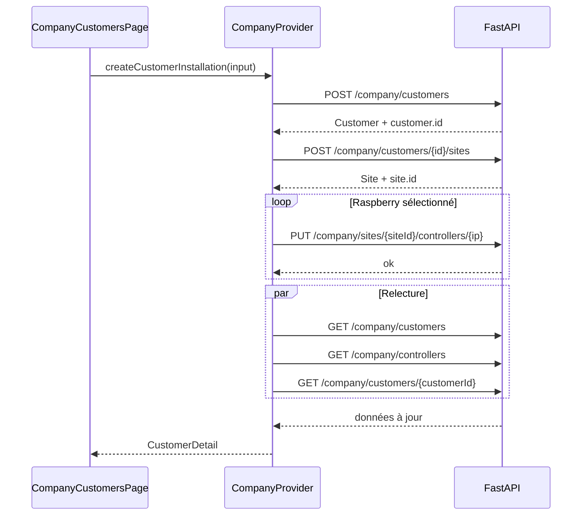

Le frontend **ne construit pas manuellement la fiche finale**.

Il la relit depuis FastAPI, afin que le serveur reste la source de vérité.

---

# 48. Appels HTTP entreprise — commentaires

```text
getComments()
GET /api/company/comments?targetType=...&targetId=...
```

```text
createComment()
POST /api/company/comments
```

Cibles possibles :

```text
ALERT
CUSTOMER
SUPPORT_TICKET
```

---

# 49. Appels HTTP entreprise — support

| Fonction | Méthode | Route |
|---|---:|---|
| `getSupportTickets()` | GET | `/api/company/support` |
| `getSupportTicket()` | GET | `/api/company/support/{ticketId}` |
| `addSupportMessage()` | POST | `/api/company/support/{ticketId}/messages` |
| `updateSupportTicketStatus()` | PUT | `/api/company/support/{ticketId}/status` |

Le backend possède également une route de création de ticket support, mais elle n’est pas encore appelée depuis l’interface entreprise actuelle.

---

# 50. Appels HTTP entreprise — terrain et audit

```text
getFieldAgents()
GET /api/company/agents
```

```text
getInterventions(customerId?)
GET /api/company/interventions
```

```text
getAuditLogs(customerId?)
GET /api/company/audit
```

---

# 51. Health check entreprise

```text
pingCompanyApi()
GET /api/company/health
```

Réponse attendue :

```json
{
  "ok": true
}
```

---

# 52. `CompanyProvider.tsx`

Fichier :

```text
src/contexts/CompanyProvider.tsx
```

Il maintient les états :

```text
dashboardStatistics

alerts
selectedAlert

customers
selectedCustomer
controllers

supportTickets
selectedSupportTicket

fieldAgents
interventions
auditLogs

connectionStatus
loading
error
feedback
```

---

# 53. Chargements indépendants entreprise

`CompanyLoadingState` sépare :

```text
dashboard
alerts
alertDetail
customers
customerDetail
controllers
customerCreation
support
supportDetail
agents
audit
interventions
action
```

Ainsi, charger une fiche client ne bloque pas obligatoirement tout le centre de supervision.

---

# 54. Fonctions principales de `CompanyProvider`

## Connexion

```text
checkCompanyConnection()
```

→ `GET /api/company/health`

## Dashboard

```text
refreshDashboard()
```

## Alertes

```text
refreshAlerts()
openAlert()
clearSelectedAlert()
takeAlert()
changeAlertStatus()
registerCall()
dispatchAgent()
escalateAlert()
addAlertComment()
```

## Matériel depuis une alerte

```text
openAlertCamera()
takeAlertScreenshot()
sendAlertRobotCommand()
setAlertEquipmentEnabled()
```

## Clients

```text
refreshCustomers()
openCustomer()
clearSelectedCustomer()
refreshControllers()
createCustomerInstallation()
loadCustomerStatistics()
addCustomerComment()
```

## Support

```text
refreshSupportTickets()
openSupportTicket()
clearSelectedSupportTicket()
sendSupportMessage()
changeSupportStatus()
addSupportComment()
```

## Terrain

```text
refreshFieldAgents()
refreshInterventions()
```

## Audit

```text
refreshAuditLogs()
```

## Transversal

```text
clearError()
clearFeedback()
```

---

# 55. Particularité du `CompanyProvider`

Contrairement à `SystemProvider`, il n’exécute pas un polling global toutes les deux secondes.

Pourquoi ?

Le centre entreprise contient beaucoup plus de ressources :

```text
dashboard
alertes
clients
support
agents
interventions
audit
```

Actuellement :

- `CompanyLayout` vérifie la connexion ;
- chaque page charge les données dont elle a besoin ;
- le bouton `Actualiser` permet de relire les données.

Un WebSocket ou un polling ciblé pourra être ajouté plus tard pour les alertes temps réel.

---

# 56. `company-context.ts`

Il définit le contrat public de `CompanyProvider`.

Il ne contient :

- aucun fetch ;
- aucun JSX ;
- aucune logique métier.

C’est le contrat :

```text
CompanyProvider
      ↓
CompanyContext
      ↓
useCompany
      ↓
Pages entreprise
```

---

# 57. `useCompany.ts`

Même principe que `useSystem()`.

Si un composant appelle :

```text
useCompany()
```

sans être placé sous :

```tsx
<CompanyProvider>
```

une erreur explicite est levée.

---

# 58. `CompanyLayout.tsx`

Fichier :

```text
src/components/company/CompanyLayout.tsx
```

Il fournit une interface commune desktop :

```text
Sidebar
Topbar
État API
Opérateur
Navigation
Outlet
```

Navigation :

```text
Vue d'ensemble
Alertes
Clients
Support
Terrain
Infrastructure
Audit
```

---

# 59. Gestion serveur absent côté entreprise

Au montage :

```text
CompanyLayout
   ↓
checkCompanyConnection()
   ↓
GET /api/company/health
```

Si FastAPI répond :

```text
connectionStatus = CONNECTED
```

→ `<Outlet />` est monté.

Si FastAPI ne répond pas :

```text
connectionStatus = DISCONNECTED
```

→ les pages métier **ne sont pas montées**.

C’est important :

```text
Serveur absent
    ↓
pas de CompanyAlertsPage
pas de CompanyCustomersPage
pas de CompanySupportPage
...
```

Donc le frontend ne doit plus lancer inutilement des dizaines de requêtes destinées à échouer.

## Schéma

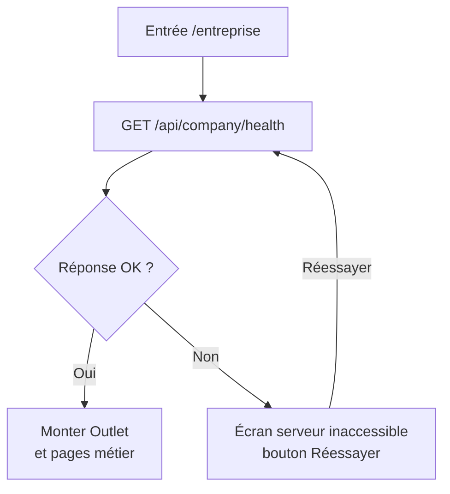

---

# 60. Pourquoi un HTTP 502 est normal à la maison

Quand le serveur `192.168.1.1:8000` n’existe pas sur le réseau actuel :

```text
Navigateur
  ↓
GET /api/company/health
  ↓
Vite
  ↓
essaie API_PROXY_TARGET
  ↓
192.168.1.1:8000 inaccessible
  ↓
502
```

Le `502` correspond donc au proxy Vite qui n’a pas pu joindre FastAPI.

Il ne signifie pas nécessairement que le code React est incorrect.

L’interface traite maintenant cet échec comme :

```text
Serveur central inaccessible
```

et non comme :

```text
0 alerte
0 client
```

---

# 61. `CompanyDashboardPage.tsx`

Route :

```text
/entreprise
```

Elle présente des KPI globaux :

```text
alertes actives
alertes critiques
alertes à prendre en charge
clients surveillés
sites
équipements online/offline
intervenants disponibles
interventions actives
tickets support
temps moyen de prise en charge
```

Elle affiche aussi :

- alertes récentes ;
- support récent ;
- état opérationnel.

---

# 62. `CompanyAlertsPage.tsx`

Route :

```text
/entreprise/alertes
```

C’est la principale console opérationnelle.

Elle permet :

- recherche ;
- filtre statut ;
- filtre priorité ;
- ouverture du dossier ;
- prise en charge ;
- changement de statut ;
- appel client ;
- affectation intervenant ;
- escalade ;
- consultation caméra ;
- capture ;
- commande robot ;
- timeline ;
- commentaires internes.

## Workflow possible

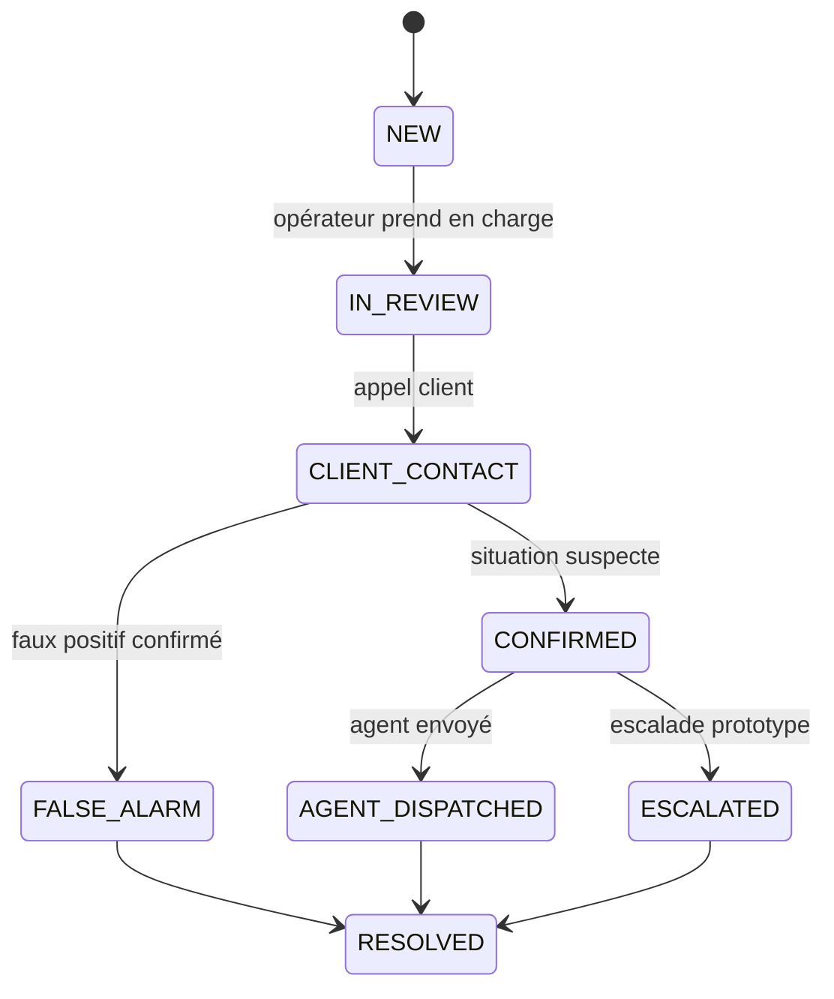

L’escalade du prototype **n’appelle pas réellement la police**.

Elle crée une trace métier et un log.

---

# 63. `CompanyCustomersPage.tsx`

Route :

```text
/entreprise/clients
```

Interface pensée principalement pour un PC d’administration.

Fonctions :

- recherche client ;
- filtre statut ;
- liste clients ;
- création client ;
- fiche client ;
- sites ;
- Raspberry ;
- composants ;
- contacts urgence ;
- alertes ;
- activité ;
- statistiques ;
- support ;
- commentaires ;
- audit.

---

# 64. Création d’un client dans `CompanyCustomersPage`

Le composant :

```text
CreateCustomerInstallationModal
```

possède trois étapes.

## Étape 1 — Client

Champs obligatoires :

```text
firstName
lastName
email
phone
```

Option :

```text
notes
```

## Étape 2 — Site

Champs :

```text
name
address
city
postalCode
country
```

## Étape 3 — Installation

La page demande :

```text
refreshControllers()
```

→ `GET /api/company/controllers`.

Elle affiche uniquement comme sélectionnables les Raspberry :

```text
assigned === false
```

Un dossier peut également être créé **sans matériel**, ce qui permet d’installer physiquement les Raspberry plus tard.

---

# 65. Fiche « Installation & appareils »

Une fiche client peut afficher :

```text
Client
└── Site
    ├── Raspberry fixe
    │   ├── camera
    │   └── motion_sensor
    │
    └── Raspberry mobile
        ├── camera
        ├── robot
        └── servo
```

Chaque contrôleur indique :

```text
IP
type FIXED/MOBILE
ONLINE/OFFLINE
lastSeen
```

Chaque composant indique :

```text
name
kind
enabled
value
status
lastSeen
```

---

# 66. `CompanySupportPage.tsx`

Route :

```text
/entreprise/support
```

Fonctions :

- recherche tickets ;
- filtres priorité/statut ;
- détail ticket ;
- informations client ;
- changement statut ;
- fil de messages ;
- réponse entreprise ;
- note interne ;
- commentaires internes.

Différence :

```text
message internal=false
→ message du fil support

message internal=true
→ note interne dans le fil

CompanyComment
→ commentaire métier distinct
```

---

# 67. `CompanyInterventionsPage.tsx`

Route :

```text
/entreprise/interventions
```

Deux vues :

```text
Intervenants
Interventions
```

Pour les agents :

```text
AVAILABLE
DISPATCHED
ON_SITE
OFF_DUTY
```

Pour les missions :

- agent ;
- client ;
- site ;
- alerte ;
- statut ;
- `requestedAt` ;
- `acceptedAt` ;
- `arrivedAt` ;
- `completedAt` ;
- rapport.

## Limitation actuelle

L’interface consulte les états mais le frontend ne possède pas encore de route permettant de faire passer manuellement une intervention de :

```text
REQUESTED
→ ACCEPTED
→ ON_THE_WAY
→ ON_SITE
→ COMPLETED
```

Cette partie est donc actuellement en lecture seule.

---

# 68. `CompanyAuditPage.tsx`

Route :

```text
/entreprise/audit
```

L’audit est en lecture seule.

La page filtre localement :

- texte ;
- catégorie ;
- acteur ;
- type de ressource ;
- date début ;
- date fin.

Catégories visuelles déduites :

```text
ALERT
HARDWARE
SUPPORT
CUSTOMER
INTERVENTION
OTHER
```

Ces catégories visuelles ne modifient jamais le log stocké.

---

# 69. `CompanyInfrastructurePage.tsx` — Supervision de l’infrastructure réseau

Route :

```text
/entreprise/infrastructure
```

## 69.1 Pourquoi cette page existe

L’interface entreprise ne doit pas uniquement permettre de traiter des alertes. Un opérateur doit également pouvoir comprendre rapidement si le système de surveillance lui-même fonctionne.

La page **Infrastructure réseau** répond donc à une question différente de la page Alertes :

```text
Page Alertes
→ Que se passe-t-il chez le client ?

Page Infrastructure
→ Est-ce que notre système technique communique correctement ?
```

Cette page doit permettre de visualiser en un coup d’œil :

- le serveur central ;
- le switch ;
- le poste administrateur React ;
- les Raspberry connus du serveur ;
- leur adresse IP ;
- leur type fixe ou mobile ;
- leur état `ONLINE` / `OFFLINE` ;
- leur dernier heartbeat ;
- leur affectation à un client et à un site ;
- les composants déclarés par chaque Raspberry ;
- l’état actif/désactivé des composants ;
- l’état logique des communications ;
- l’état physique du lien RJ45 **si cette information est réellement télémétrée** ;
- l’accessibilité de l’API locale Raspberry sur le port `8001` **si FastAPI la mesure**.

---

## 69.2 Route React

La page est accessible à l’adresse :

```text
/entreprise/infrastructure
```

Elle est déclarée dans :

```text
src/App.tsx
```

sous le même `CompanyProvider` que les autres pages entreprise :

```tsx
<Route
  path="/entreprise"
  element={
    <CompanyProvider>
      <CompanyLayout />
    </CompanyProvider>
  }
>
  ...

  <Route
    path="infrastructure"
    element={
      <CompanyInfrastructurePage />
    }
  />

  ...
</Route>
```

Cela signifie que la page bénéficie du même contexte entreprise que :

```text
/entreprise
/entreprise/alertes
/entreprise/clients
/entreprise/support
/entreprise/interventions
/entreprise/audit
```

---

## 69.3 Fichiers impliqués

### `src/pages/CompanyInfrastructurePage.tsx`

Responsable de :

- l’affichage de la topologie ;
- la récupération des contrôleurs depuis `CompanyProvider` ;
- le rafraîchissement périodique ;
- l’interprétation visuelle des statuts ;
- la liste des composants ;
- le journal local des changements observés pendant la session.

### `src/styles/company-infrastructure.css`

Responsable de :

- la topologie visuelle ;
- les lignes réseau ;
- les couleurs fonctionnelles ;
- les cartes serveur / switch / poste admin ;
- les cartes Raspberry ;
- la légende ;
- le tableau technique ;
- le journal de session ;
- l’adaptation aux tailles d’écran plus petites.

### `src/types/company.ts`

Contient déjà :

```text
CompanyController
CompanyControllerComponent
CompanyControllerStatus
CompanyControllerType
```

La page Infrastructure ajoute des types de télémétrie réseau **optionnels** :

```text
CompanyPhysicalLinkState
CompanyNetworkMedium
CompanyLocalApiStatus
```

et les champs optionnels :

```text
networkInterface
networkMedium
physicalLinkState
localApiStatus
linkSpeedMbps
```

Ils sont optionnels afin de ne pas casser le frontend tant que le backend ne renvoie pas encore ces informations.

### `src/components/company/CompanyLayout.tsx`

Ajoute l’entrée :

```text
Infrastructure
```

à la sidebar du centre de surveillance.

Le layout continue également à effectuer le health check global avant de monter la page.

### `src/App.tsx`

Ajoute la route :

```text
/entreprise/infrastructure
```

---

## 69.4 Architecture représentée

La topologie de laboratoire est représentée conceptuellement ainsi :

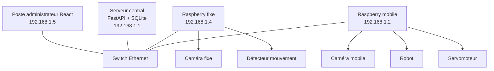

Dans l’application, les adresses `192.168.1.1` et `192.168.1.5` utilisées sur le schéma sont uniquement des **libellés de la configuration de laboratoire**.

Elles ne sont jamais utilisées par la page pour effectuer directement une requête réseau.

Les appels React continuent à utiliser :

```text
/api/...
```

via le proxy Vite.

---

## 69.5 Variables d’affichage optionnelles

Pour éviter de coder des IP fonctionnelles directement dans le composant, deux variables peuvent être ajoutées à `.env.local` :

```env
VITE_INFRA_SERVER_IP=192.168.1.1
VITE_INFRA_ADMIN_IP=192.168.1.5
```

Ces variables servent uniquement à afficher les IP sur le schéma.

La connexion réelle à FastAPI reste configurée avec :

```env
VITE_API_BASE_URL=/api
API_PROXY_TARGET=http://192.168.1.1:8000
```

---

## 69.6 Différence fondamentale : câble ≠ communication

C’est le point le plus important de cette page.

Il existe au moins deux états différents :

```text
ÉTAT PHYSIQUE
Le câble Ethernet est-il électriquement connecté ?

ÉTAT LOGIQUE
Le Raspberry communique-t-il avec FastAPI ?
```

Ces états ne sont pas équivalents.

## Exemple A — fonctionnement normal

```text
Câble RJ45 branché
+ Raspberry allumé
+ programme lancé
+ heartbeat reçu

→ câble CONNECTED
→ Raspberry ONLINE
```

## Exemple B — Raspberry éteint

```text
Câble RJ45 branché
+ Raspberry éteint

→ le serveur ne reçoit plus de heartbeat
→ Raspberry OFFLINE
```

Mais le serveur ne peut pas conclure automatiquement :

```text
câble débranché
```

car le même symptôme peut être provoqué par l’arrêt du Raspberry.

## Exemple C — programme Raspberry planté

```text
Câble branché
Raspberry allumé
Linux fonctionne
programme de surveillance arrêté

→ heartbeat absent
→ Raspberry OFFLINE
→ câble peut pourtant être physiquement présent
```

## Exemple D — câble réellement retiré

```text
Raspberry allumé
programme fonctionnel
câble RJ45 retiré

→ heartbeat perdu
```

Sans autre source d’information, le serveur voit exactement le même symptôme que dans les exemples B et C.

---

## 69.7 Limite physique importante

Un Raspberry connecté uniquement par son câble Ethernet ne peut pas envoyer au serveur :

```text
« mon câble Ethernet vient d’être débranché »
```

**après** que le câble a été retiré, puisque son moyen de communication vient précisément de disparaître.

Pour connaître de façon certaine l’état physique du câble après déconnexion, il faut au moins une des solutions suivantes :

### Solution 1 — switch administrable

Le serveur interroge les ports du switch et sait :

```text
port 1 : link up
port 2 : link down
port 3 : link up
```

### Solution 2 — deuxième réseau de secours

Exemple :

```text
RJ45 principal
+
Wi-Fi de supervision
```

Le Raspberry peut alors détecter localement :

```text
/sys/class/net/eth0/carrier = 0
```

et transmettre cette information au serveur via Wi-Fi.

### Solution 3 — déduction logique uniquement

Si aucun switch administrable ni deuxième lien n’existe, la valeur fiable est :

```text
communication active
ou
communication perdue
```

mais pas :

```text
câble forcément branché
ou
câble forcément débranché
```

La page React est volontairement conçue pour respecter cette limite.

---

## 69.8 États visuels

La page utilise quatre familles de couleurs.

## Vert

```text
ONLINE
communication active
lien physique CONNECTED si télémétré
API locale REACHABLE
```

## Rouge

```text
OFFLINE
liaison physique explicitement DISCONNECTED
API locale explicitement UNREACHABLE
```

## Orange

Réservé à un état dégradé, par exemple :

```text
lien physique connu présent
mais
communication logique perdue
```

Cette information ne doit être affichée que si le backend dispose d’une télémétrie physique encore valide.

## Gris

```text
UNKNOWN
non télémétré
non vérifié
```

Le gris signifie :

> le système ne possède pas assez d’informations pour conclure.

Il ne signifie pas automatiquement une panne.

---

## 69.9 Règles d’affichage des lignes

Pour chaque Raspberry, le frontend calcule un état visuel de liaison.

Fonction :

```text
linkVisualState(controller)
```

La logique est conceptuellement :

```text
physicalLinkState == DISCONNECTED
    ↓
liaison rouge / débranchée

sinon controller.status == ONLINE
    ↓
liaison verte / communication active

sinon physicalLinkState == CONNECTED
     ET controller.status == OFFLINE
    ↓
liaison orange / dégradée

sinon
    ↓
liaison grise / indéterminée
```

---

## 69.10 Source des Raspberry affichés

La page ne possède aucune liste statique du type :

```ts
const raspberry1 = '192.168.1.2'
const raspberry2 = '192.168.1.4'
```

Elle appelle :

```text
refreshControllers()
```

fourni par :

```text
CompanyProvider
```

qui utilise :

```text
getCompanyControllers()
```

situé dans :

```text
src/services/companyApi.ts
```

Cet appel fait :

```http
GET /api/company/controllers
```

Le serveur central doit donc être la source de vérité.

---

## 69.11 Appels HTTP effectués par la page

La page Infrastructure ne contacte jamais directement un Raspberry.

## Appel 1 — health check entreprise

Effectué par `CompanyLayout` :

```http
GET /api/company/health
```

But :

```text
React peut-il atteindre FastAPI ?
```

Si la réponse échoue, la page Infrastructure n’est pas montée.

Le layout affiche :

```text
Serveur central inaccessible
```

## Appel 2 — liste des Raspberry

Effectué par `CompanyInfrastructurePage` via `CompanyProvider` :

```http
GET /api/company/controllers
```

But :

- connaître les Raspberry ;
- leurs IP ;
- leur état ;
- leur dernier heartbeat ;
- leur site ;
- leur client ;
- leurs composants ;
- plus tard, leur télémétrie réseau physique.

---

## 69.12 Fréquence d’actualisation

La page utilise deux fréquences.

## Raspberry

```text
5 secondes
```

Constante :

```text
CONTROLLERS_REFRESH_INTERVAL_MS = 5000
```

Cela correspond à la fréquence de heartbeat prévue pour les Raspberry.

## Serveur central

```text
10 secondes
```

Constante :

```text
HEALTH_REFRESH_INTERVAL_MS = 10000
```

Le health check sert à détecter une perte complète de FastAPI.

---

## 69.13 Séquence de polling

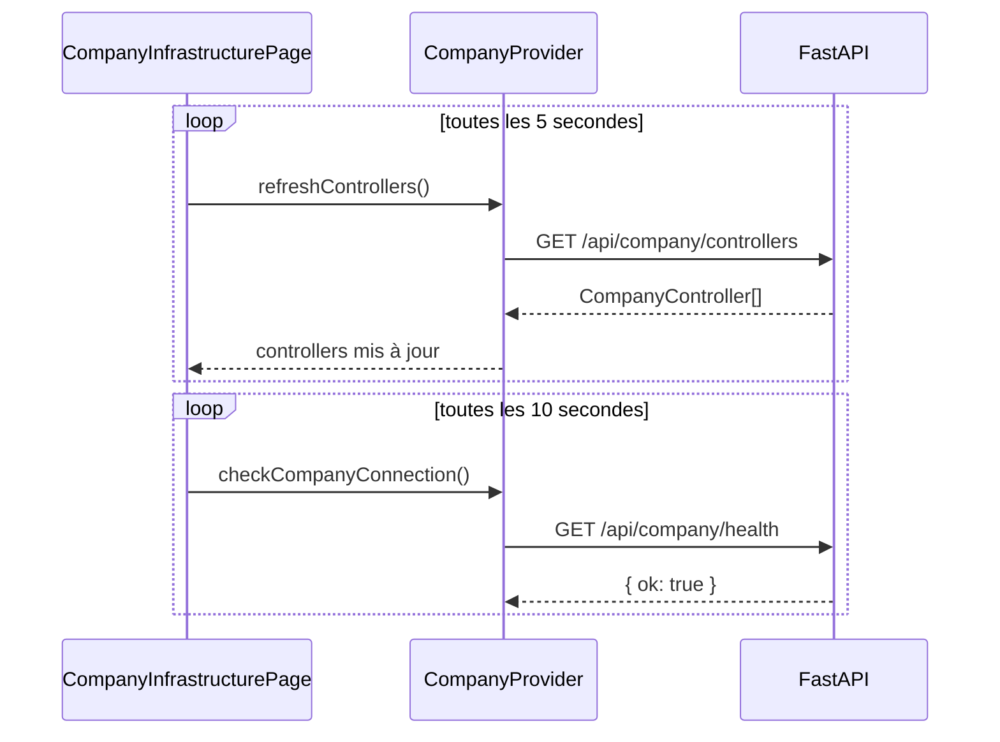

---

## 69.14 Contenu d’un `CompanyController`

Le contrat actuel contient :

```text
ip
controllerType
hasServo
status
lastSeen
assigned
siteId
siteName
customerId
customerName
components[]
```

Exemple :

```json
{
  "ip": "192.168.1.4",
  "controllerType": "FIXED",
  "hasServo": false,
  "status": "ONLINE",
  "lastSeen": "2026-09-07T09:42:16",
  "assigned": true,
  "siteId": "site-001",
  "siteName": "Maison principale",
  "customerId": "customer-001",
  "customerName": "Client Test",
  "components": []
}
```

---

## 69.15 Champs réseau optionnels attendus

Le React est maintenant prêt à lire également :

```text
networkInterface
networkMedium
physicalLinkState
localApiStatus
linkSpeedMbps
```

Exemple cible :

```json
{
  "ip": "192.168.1.4",
  "controllerType": "FIXED",
  "status": "ONLINE",

  "networkInterface": "eth0",
  "networkMedium": "RJ45",
  "physicalLinkState": "CONNECTED",
  "localApiStatus": "REACHABLE",
  "linkSpeedMbps": 100
}
```

Ces champs seront ajoutés au contrat Raspberry / FastAPI dans l’étape suivante du projet.

---

## 69.16 Valeurs autorisées

## `physicalLinkState`

```text
CONNECTED
DISCONNECTED
UNKNOWN
```

## `networkMedium`

```text
RJ45
WIFI
OTHER
UNKNOWN
```

## `localApiStatus`

```text
REACHABLE
UNREACHABLE
UNKNOWN
```

---

## 69.17 Composants affichés

Chaque `CompanyController` contient :

```text
components[]
```

Un composant possède :

```text
id
controllerIp
name
kind
enabled
value
status
lastSeen
```

La page convertit certains noms techniques en labels humains.

Exemples :

```text
camera
→ Caméra

motion_sensor
→ Détecteur de mouvement

photoresistance
→ Photorésistance

servo
→ Servomoteur

robot
→ Robot
```

---

## 69.18 Exemple Raspberry fixe

```text
Raspberry fixe
192.168.1.4
● En ligne

Câble RJ45 branché
API locale :8001 joignable

Maison principale
Client Test

Composants :
● Caméra — activée — en ligne
● Détecteur de mouvement — activé — en ligne

Dernier heartbeat : 09:42:16
```

---

## 69.19 Exemple Raspberry mobile

```text
Raspberry mobile
192.168.1.2
● En ligne

Câble RJ45 branché
API locale :8001 joignable

Maison principale
Client Test

Composants :
● Caméra — activée — en ligne
● Robot — activé — en ligne
● Servomoteur — activé — en ligne
```

---

## 69.20 Affectation à un client

La page Infrastructure ne modifie pas les installations.

Elle lit simplement :

```text
assigned
siteId
siteName
customerId
customerName
```

L’affectation reste effectuée dans :

```text
/entreprise/clients
```

avec le workflow :

```text
Customer
  ↓
MonitoredSite
  ↓
CompanyController
  ↓
Components
```

---

## 69.21 Journal des changements de session

La page maintient un petit journal visuel :

```text
Changements observés pendant cette session
```

Il peut afficher :

```text
10:42:18 Raspberry mobile 192.168.1.2 est repassé en ligne.
10:43:05 Caméra (192.168.1.4) est hors ligne.
10:43:12 Lien Ethernet perdu sur 192.168.1.4.
10:44:02 Robot (192.168.1.2) a été désactivé.
```

## Important

Ce journal est stocké uniquement dans le state React :

```text
sessionEvents
```

Il est perdu lors d’un rechargement de page.

Il ne remplace pas :

```text
AuditLog
```

qui reste une trace métier persistée par FastAPI.

---

## 69.22 Pourquoi le premier chargement ne crée pas de faux événements

Lorsque la page reçoit les Raspberry pour la première fois, elle crée un snapshot :

```text
previousSnapshotsRef
```

Elle n’écrit pas :

```text
Raspberry connecté
```

pour tous les Raspberry déjà en ligne.

Sinon l’ouverture de la page donnerait à tort l’impression que tous les appareils viennent de se reconnecter.

Les événements ne sont ajoutés que lorsqu’une différence réelle est observée entre deux lectures successives.

---

## 69.23 Changements détectés

Le frontend compare :

```text
ancien snapshot
vs
nouveau snapshot
```

Il surveille :

### Raspberry

```text
ONLINE → OFFLINE
OFFLINE → ONLINE
```

### lien physique

```text
CONNECTED → DISCONNECTED
DISCONNECTED → CONNECTED
```

si la télémétrie existe.

### composants

```text
ONLINE → OFFLINE
OFFLINE → ONLINE

enabled=true → false
enabled=false → true
```

---

## 69.24 Tableau technique

En dessous du schéma, la page présente un tableau.

Colonnes :

```text
Nœud
IP
Communication
Câble physique
API locale
Site / client
Dernier contact
```

L’objectif est de disposer à la fois :

- d’une représentation graphique immédiate ;
- d’une vue tabulaire précise pour le diagnostic.

---

## 69.25 État du switch

Le switch actuel est considéré comme un équipement de transit.

S’il n’est pas administrable, React ne peut pas connaître :

```text
état du port 1
état du port 2
état du port 3
```

La page affiche donc honnêtement :

```text
Switch réseau
Équipement passif non télémétré
```

Le switch n’est pas déclaré « ONLINE » uniquement parce qu’un rectangle est présent dans le schéma.

---

## 69.26 État du poste administrateur

Le poste administrateur correspond au navigateur qui affiche actuellement l’interface React.

Si la page est rendue, l’application React est nécessairement active dans ce navigateur.

Cela ne signifie pas que toutes les interfaces réseau du PC sont saines.

Le bloc indique donc uniquement :

```text
React / Vite actif
```

et non :

```text
câble du PC certainement branché
```

---

## 69.27 État du serveur

Le serveur est considéré accessible lorsque :

```text
GET /api/company/health
```

répond correctement.

La topologie peut donc afficher :

```text
Serveur central
192.168.1.1
API FastAPI accessible
```

ou le `CompanyLayout` bascule entièrement sur l’écran hors connexion.

---

## 69.28 Ce qui sera visible immédiatement avec le backend actuel

Sans aucune télémétrie réseau supplémentaire, la page peut déjà afficher :

```text
serveur accessible / inaccessible
Raspberry connus
IP Raspberry
FIXED / MOBILE
ONLINE / OFFLINE
dernier heartbeat
site/client
composants
enabled/disabled
composant ONLINE/OFFLINE
```

Donc le scénario :

```text
Raspberry débranché du réseau
→ heartbeat s'arrête
→ après seuil serveur
→ controller.status = OFFLINE
→ carte Raspberry rouge
→ ligne logique n'est plus active
```

fonctionne déjà grâce au mécanisme de heartbeat.

---

## 69.29 Ce qui nécessite le prochain travail Raspberry / backend

Pour afficher séparément :

```text
câble RJ45 réellement branché / débranché
```

il faut encore implémenter la télémétrie correspondante.

Le React est déjà prêt à recevoir :

```text
physicalLinkState
networkInterface
networkMedium
linkSpeedMbps
localApiStatus
```

Le prochain document destiné aux camarades Raspberry précisera comment produire ces informations.

Le backend devra ensuite les stocker / calculer et les renvoyer dans :

```http
GET /api/company/controllers
```

---

## 69.30 Contrat Raspberry recommandé pour la télémétrie Ethernet

Le prochain format de heartbeat pourra être étendu avec une section :

```json
{
  "has_servo": false,
  "components": [],
  "network": {
    "interface": "eth0",
    "medium": "RJ45",
    "physical_link": "CONNECTED",
    "link_speed_mbps": 100
  }
}
```

Sous Linux, l’état local du carrier Ethernet peut notamment être lu depuis :

```text
/sys/class/net/eth0/carrier
```

avec généralement :

```text
1 = lien physique présent
0 = lien physique absent
```

Cependant, cette valeur ne peut être transmise au serveur après perte du seul lien réseau. Cette limite doit donc être prise en compte par le backend.

---

## 69.31 Contrat API locale recommandé

Chaque Raspberry doit exposer son API locale sur :

```text
0.0.0.0:8001
```

Pour que FastAPI puisse distinguer :

```text
Raspberry en ligne
mais
API de contrôle locale indisponible
```

un endpoint léger est recommandé :

```http
GET /health
```

Réponse :

```json
{
  "ok": true
}
```

FastAPI pourra alors produire :

```text
localApiStatus = REACHABLE
```

ou :

```text
localApiStatus = UNREACHABLE
```

Cette partie sera détaillée dans le document Raspberry.

---

## 69.32 Diagramme de diagnostic

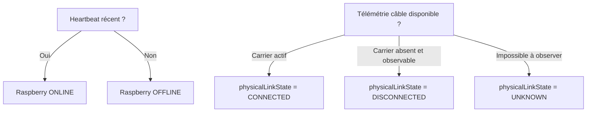

---

## 69.33 Scénarios de diagnostic à montrer au professeur

## Scénario 1 — système nominal

```text
Serveur : vert
Switch : gris / passif
Raspberry fixe : vert
Raspberry mobile : vert
Composants : verts
Liaisons logiques : vertes
```

## Scénario 2 — Raspberry éteint

```text
heartbeat perdu
Raspberry : rouge
composants : hors ligne
câble physique : inconnu sauf télémétrie externe
```

## Scénario 3 — câble Raspberry retiré

Sans télémétrie externe :

```text
heartbeat perdu
Raspberry : rouge
liaison logique perdue
câble physique : indéterminé
```

Avec switch administrable ou liaison de secours :

```text
physicalLinkState = DISCONNECTED
ligne : rouge / pointillée
badge : Câble RJ45 débranché
```

## Scénario 4 — câble présent mais service local en panne

```text
Raspberry heartbeat : ONLINE
physicalLinkState : CONNECTED
localApiStatus : UNREACHABLE
```

L’opérateur peut alors comprendre que le problème n’est probablement pas le câble mais le service local de contrôle.

---

## 69.34 Test lundi — étape Infrastructure

Après démarrage du serveur et des Raspberry :

### 1. Ouvrir

```text
/entreprise/infrastructure
```

### 2. Vérifier le serveur

Attendu :

```text
Serveur central
En ligne
```

### 3. Vérifier les Raspberry

Attendu :

```text
192.168.1.2
MOBILE
ONLINE

192.168.1.4
FIXED
ONLINE
```

### 4. Vérifier les composants

Exemple fixe :

```text
camera
motion_sensor
```

Exemple mobile :

```text
camera
robot
servo
```

### 5. Vérifier l’affectation

Après création du client :

```text
Client Test
└── Maison principale
    ├── 192.168.1.2
    └── 192.168.1.4
```

### 6. Débrancher un Raspberry du réseau

Attendre le dépassement du seuil heartbeat.

Attendu au minimum :

```text
controller.status = OFFLINE
carte rouge
journal de session mis à jour
```

### 7. Rebrancher

Attendre le retour du heartbeat.

Attendu :

```text
controller.status = ONLINE
carte verte
journal : Raspberry ... est repassé en ligne
```

### 8. Si télémétrie physique implémentée

Tester également :

```text
physicalLinkState = CONNECTED
physicalLinkState = DISCONNECTED
```

et vérifier le changement de couleur de la liaison.

---

## 69.35 Appels nécessaires pour cette page lundi

## React → FastAPI

```http
GET /api/company/health
GET /api/company/controllers
```

Aucun appel React direct vers :

```text
192.168.1.2:8001
192.168.1.4:8001
```

n’est autorisé.

## Raspberry → FastAPI

Toujours nécessaire :

```http
POST /api/controleurs/heartbeat
```

avec la liste des composants.

Plus tard dans le même payload :

```text
network telemetry
```

## FastAPI → Raspberry

Pour l’état de l’API locale, FastAPI pourra effectuer :

```http
GET http://{controllerIp}:8001/health
```

Cette vérification appartient au backend, pas au navigateur.

---

## 69.36 Pourquoi aucune nouvelle route `/infrastructure` n’est obligatoire

La page utilise volontairement les ressources déjà existantes :

```text
/company/health
/company/controllers
```

Cela évite d’introduire une route supplémentaire uniquement pour dessiner le schéma.

Le endpoint `/company/controllers` peut devenir progressivement plus riche sans changer l’architecture React.

---

## 69.37 Sécurité architecturale

La règle reste :

```text
React
  ↓
FastAPI
  ↓
Raspberry
```

La page Infrastructure ne doit jamais faire :

```ts
fetch('http://192.168.1.2:8001/...')
```

ou :

```ts
fetch('http://192.168.1.4:8001/...')
```

Sinon :

- le navigateur dépendrait du plan d’adressage ;
- le téléphone ne pourrait pas forcément joindre le Raspberry ;
- l’audit central serait contourné ;
- les problèmes CORS et routage se multiplieraient ;
- le serveur ne serait plus le point central de contrôle.

---

## 69.38 Résultat attendu de la page

La page doit permettre de répondre immédiatement aux questions suivantes :

```text
Le serveur répond-il ?

Quels Raspberry sont connus ?

Quel Raspberry est hors ligne ?

Depuis quand ?

À quel client appartient-il ?

Quels composants sont attachés à ce Raspberry ?

Un composant est-il désactivé ?

La communication est-elle active ?

Le câble physique est-il réellement connu comme branché ?

L’API locale du Raspberry répond-elle ?
```

---

## 69.39 Résumé fonctionnel

```text
CompanyInfrastructurePage
        ↓
useCompany()
        ↓
CompanyProvider
        ↓
refreshControllers()
        ↓
companyApi.ts
        ↓
GET /api/company/controllers
        ↓
FastAPI
        ↓
controleurs + composants + site_controllers
        ↓
React
        ↓
Topologie + couleurs + tableau + journal de session
```

---

## 69.40 Évolution prévue

Cette page est volontairement conçue pour rester compatible avec l’évolution du système.

Étape actuelle :

```text
heartbeat
→ ONLINE / OFFLINE
→ composants
```

Étape suivante :

```text
heartbeat enrichi
→ interface réseau
→ carrier RJ45
→ débit
```

Puis :

```text
FastAPI
→ contrôle API locale :8001
→ localApiStatus
```

Éventuellement plus tard :

```text
switch administrable
→ état réel de chaque port
→ câble physiquement observable côté infrastructure
```

Le React n’aura pas besoin d’être reconstruit pour ces évolutions : les champs réseau sont déjà optionnels dans le type `CompanyController` et la page sait déjà les afficher lorsqu’ils existent.

---

# 70. Organisation CSS

## `index.css`

Styles globaux de base.

## `App.css`

Actuellement vide.

## `login.css`

Page d’entrée.

## `dashboard.css`

Classes transversales de pages / headings / états.

## `user-dashboard.css`

Layout utilisateur et une grande partie des pages utilisateur.

## `equipment-control.css`

Cartes appareils et contrôles caméra.

## `statistics-page.css`

Graphiques/statistiques.

## `history-page.css`

Historique desktop/mobile.

## `system-connection.css`

Popup et états réseau.

## `company-layout.css`

Sidebar, topbar et shell desktop de l’entreprise.

## `company-dashboard.css`

Dashboard centre de surveillance.

## `company-alerts.css`

Console alertes.

## `company-customers.css`

Dossiers clients, formulaire de création, installation et appareils.

## `company-support.css`

Support.

## `company-interventions.css`

Agents et interventions.

## `company-infrastructure.css`

Topologie réseau, états de liaison, cartes Raspberry, légende, tableau technique et journal de session de la page Infrastructure.

## `company-audit.css`

Journal d’audit.

---

# 71. Contrat intégration lundi — vue globale

Pour que le système fonctionne de bout en bout lundi, trois familles d’appels doivent fonctionner.

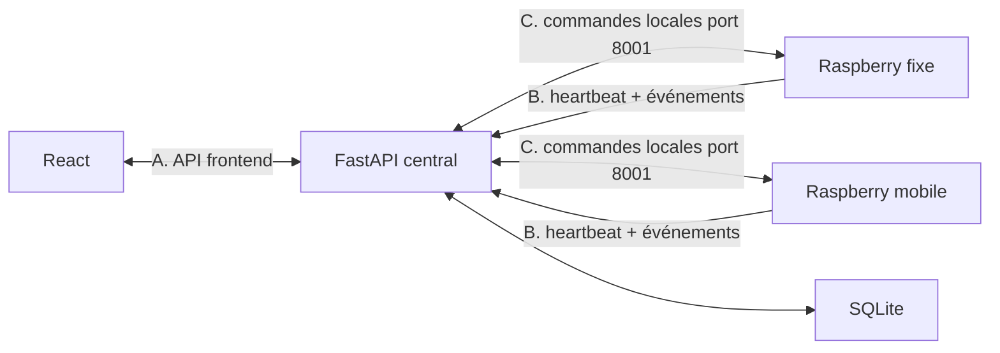

---

# 72. A — Appels React → FastAPI indispensables lundi

## Santé

```http
GET /api/health
GET /api/company/health
```

## Données utilisateur

```http
GET /api/system
GET /api/equipements
GET /api/evenements
GET /api/media
```

## Commandes utilisateur

```http
PUT /api/system
PUT /api/equipements/{equipmentId}/enabled
POST /api/evenements/{eventId}/decision
POST /api/robot/command
POST /api/cameras/{cameraId}/screenshot
PUT /api/media/{mediaId}/saved
```

## Entreprise — données minimales

```http
GET /api/company/dashboard
GET /api/company/alerts
GET /api/company/customers
GET /api/company/controllers
GET /api/company/agents
GET /api/company/interventions
GET /api/company/audit
```

## Entreprise — création installation

```http
POST /api/company/customers
POST /api/company/customers/{customerId}/sites
PUT /api/company/sites/{siteId}/controllers/{controllerIp}
GET /api/company/sites/{siteId}/controllers
GET /api/company/customers/{customerId}
```

## Entreprise — traitement alerte

```http
GET  /api/company/alerts/{alertId}
POST /api/company/alerts/{alertId}/take
PUT  /api/company/alerts/{alertId}/status
POST /api/company/alerts/{alertId}/client-call
POST /api/company/alerts/{alertId}/dispatch
POST /api/company/alerts/{alertId}/emergency-escalation
```

## Entreprise — matériel audité

```http
POST /api/company/alerts/{alertId}/cameras/{cameraId}/view
POST /api/company/alerts/{alertId}/cameras/{cameraId}/screenshot
POST /api/company/alerts/{alertId}/robot-command
PUT  /api/company/alerts/{alertId}/equipments/{equipmentId}/enabled
```

---

# 73. B — Appels Raspberry → FastAPI indispensables lundi

Ces appels **ne viennent pas de React**, mais le frontend en dépend.

## Heartbeat

Chaque Raspberry doit envoyer environ toutes les 5 secondes :

```http
POST http://192.168.1.1:8000/api/controleurs/heartbeat
Content-Type: application/json
```

### Raspberry fixe

```json
{
  "has_servo": false,
  "components": [
    {
      "name": "camera",
      "enabled": true,
      "value": null
    },
    {
      "name": "motion_sensor",
      "enabled": true,
      "value": false
    }
  ]
}
```

### Raspberry mobile

```json
{
  "has_servo": true,
  "components": [
    {
      "name": "camera",
      "enabled": true,
      "value": null
    },
    {
      "name": "robot",
      "enabled": true,
      "value": null
    },
    {
      "name": "servo",
      "enabled": true,
      "value": null
    }
  ]
}
```

FastAPI récupère l’IP source lui-même.

Le JSON ne doit donc pas inventer l’IP.

## Détection

```http
POST http://192.168.1.1:8000/api/evenements
```

Payload :

```json
{
  "capteur": "motion_sensor",
  "zone": "salon",
  "horodatage": 1788680000
}
```

FastAPI lit :

```text
request.client.host
```

pour savoir quel Raspberry a envoyé la détection.

---

# 74. Création automatique d’une alerte entreprise

Lorsqu’un Raspberry envoie :

```text
POST /api/evenements
```

FastAPI :

1. récupère son IP ;
2. cherche si cette IP est liée à un site ;
3. retrouve le client ;
4. cherche le composant source ;
5. cherche éventuellement une caméra sur le même Raspberry ;
6. enregistre `BackendEvent` ;
7. crée `CompanyAlert` si le Raspberry est attribué.

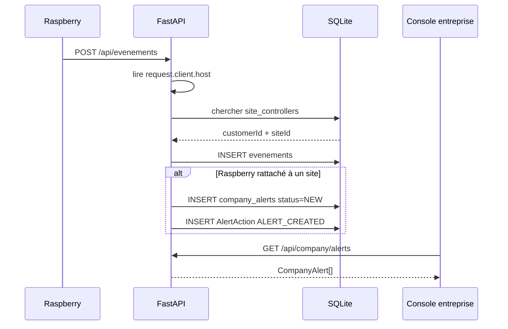

Si le Raspberry n’est pas encore rattaché :

```text
événement technique enregistré
mais
aucune fausse fiche client n'est créée
```

---

# 75. C — Appels FastAPI → Raspberry indispensables lundi

Chaque Raspberry doit exposer une API locale sur :

```text
port 8001
```

et écouter sur :

```text
0.0.0.0:8001
```

pas uniquement :

```text
127.0.0.1
```

## Système global

```http
PUT http://{raspberry-ip}:8001/system
```

Body :

```json
{
  "armed": true
}
```

## Composant

```http
PUT http://{raspberry-ip}:8001/components/{name}/enabled
```

Body :

```json
{
  "enabled": false
}
```

## Robot

Raspberry mobile :

```http
POST http://{raspberry-ip}:8001/robot/command
```

Body :

```json
{
  "command": "FORWARD",
  "speed": 50
}
```

Commandes :

```text
FORWARD
BACKWARD
LEFT
RIGHT
STOP
```

## Caméra live

```http
GET http://{raspberry-ip}:8001/camera/stream?name=camera
```

Le serveur central relaie ensuite ce flux au navigateur.

## Capture

```http
POST http://{raspberry-ip}:8001/camera/screenshot?name=camera
```

Réponse souhaitée :

```http
Content-Type: image/jpeg
```

---

# 76. Heartbeat et état ONLINE/OFFLINE

Configuration serveur actuelle :

```text
heartbeat attendu ≈ toutes les 5 secondes
seuil OFFLINE = 15 secondes
timeout commande Raspberry = 3 secondes
port API Raspberry = 8001
```

Donc :

```text
dernier heartbeat <= 15 s
→ ONLINE

dernier heartbeat > 15 s
→ OFFLINE
```

---

# 77. Séquence exacte de test recommandée lundi

## Phase 1 — réseau

Vérifier :

```text
Serveur : 192.168.1.1
Mobile  : 192.168.1.2
Fixe    : 192.168.1.4
```

Depuis le serveur :

```bash
ping 192.168.1.2
ping 192.168.1.4
```

Depuis le PC React :

```bash
ping 192.168.1.1
```

---

## Phase 2 — lancer FastAPI

Vérifier :

```text
http://192.168.1.1:8000/docs
```

puis :

```text
GET /api/health
GET /api/company/health
```

---

## Phase 3 — démarrer les Raspberry

Attendre au moins un heartbeat de chaque Raspberry.

Puis vérifier :

```text
GET /api/equipements
GET /api/company/controllers
```

Résultat attendu :

```text
Raspberry fixe visible
Raspberry mobile visible
leurs composants visibles
```

---

## Phase 4 — créer le client depuis React

Ouvrir :

```text
/entreprise/clients
```

Cliquer :

```text
Nouveau client
```

Créer :

```text
Client
→ Site
→ sélectionner Raspberry fixe et mobile
```

Le frontend doit faire automatiquement :

```text
POST customer
POST site
PUT controller fixe
PUT controller mobile
GET fiche complète
```

---

## Phase 5 — vérifier la fiche client

La fiche doit montrer :

```text
Site
├── Raspberry fixe
│   ├── status
│   └── components
└── Raspberry mobile
    ├── status
    └── components
```

---

## Phase 6 — provoquer une vraie détection

Capteur :

```text
motion_sensor
```

Raspberry :

```http
POST /api/evenements
```

Puis ouvrir :

```text
/entreprise/alertes
```

et actualiser.

Résultat attendu :

```text
CompanyAlert
customer = client créé
site = site créé
status = NEW
sourceSensor = motion_sensor
cameraId = caméra du même Raspberry si disponible
```

---

## Phase 7 — traitement opérateur

Tester dans cet ordre :

```text
Prendre en charge
→ status IN_REVIEW

Ouvrir caméra
→ flux réel

Capture
→ MediaItem + audit

Robot
→ FORWARD
→ STOP

Appeler client
→ résultat enregistré

Intervenant
→ intervention créée

Escalade
→ trace prototype uniquement

Résoudre l’alerte
```

---

## Phase 8 — vérifier l’audit

Ouvrir :

```text
/entreprise/audit
```

On doit retrouver les actions réellement effectuées.

Exemples :

```text
ALERT_STATUS_CHANGED
CAMERA_VIEW_STARTED
SCREENSHOT_CREATED
ROBOT_COMMAND_SENT
CLIENT_CALLED
FIELD_AGENT_DISPATCHED
POLICE_ESCALATION_REQUESTED
```

---

# 78. Logs à regarder pendant le test

## Console navigateur

`systemApi.ts` :

```text
[API →]
[API ←]
[API ✗]
```

`companyApi.ts` :

```text
[COMPANY API →]
[COMPANY API ←]
[COMPANY API ✗]
```

## Terminal Vite

`vite.config.ts` :

```text
[VITE → FASTAPI]
[VITE ← FASTAPI]
[VITE ✗ FASTAPI]
```

Cette séparation permet de diagnostiquer :

```text
React
vs
proxy Vite
vs
FastAPI
```

---

# 79. Exemple diagnostic

## Cas 1 — navigateur affiche 502

Si :

```text
GET /api/company/health → 502
```

et terminal Vite :

```text
[VITE ✗ FASTAPI]
```

alors Vite n’atteint pas le serveur central.

Vérifier :

```text
API_PROXY_TARGET
IP serveur
câble
switch
pare-feu
FastAPI lancé
port 8000
```

## Cas 2 — FastAPI répond mais Raspberry offline

Si :

```text
GET /api/health → 200
```

mais :

```text
GET /api/equipements
status OFFLINE
```

alors le problème est plutôt :

```text
Raspberry
heartbeat
réseau Raspberry
```

## Cas 3 — Raspberry visible mais caméra échoue

Vérifier depuis le serveur :

```text
http://192.168.1.x:8001/camera/stream?name=camera
```

avant de chercher un problème React.

---

# 80. Contrats importants à ne pas casser

## Règle 1

React ne contacte jamais :

```text
192.168.1.2
192.168.1.4
```

directement.

## Règle 2

Le Raspberry ne doit pas choisir un `customerId`.

Il envoie son événement.

FastAPI fait l’association grâce à l’IP source.

## Règle 3

Le serveur est la source de vérité.

Après une mutation, React relit les données serveur.

## Règle 4

Ne pas fabriquer de valeurs métier pour masquer une absence de données.

Exemple :

```text
serveur inaccessible ≠ 0 alerte
```

## Règle 5

L’audit est créé côté backend.

---

# 81. Ce qui est actuellement simulé ou incomplet

Pour présenter honnêtement le prototype :

### Authentification

Non implémentée.

### Opérateur entreprise

Identité temporaire :

```text
demo-operator
```

### Escalade police

Traçabilité uniquement.

Aucun appel réel aux services d’urgence.

### Statistiques de disponibilité utilisateur

Pas encore calculées car absence d’historique complet des heartbeats.

### Statuts d’intervention terrain

Lecture disponible, mais workflow complet agent non exposé par des routes React dédiées.

### Association caméra dans l’alerte utilisateur

`UserAlertsPage` sait l’utiliser, mais `toSecurityAlert()` ne remplit actuellement pas `cameraId`.

### Temps réel entreprise

Pas encore WebSocket ; chargement par page / actualisation manuelle.

---

# 82. Fichiers qui ne doivent pas être modifiés par les Raspberry

Les camarades Raspberry n’ont pas besoin de toucher à :

```text
src/services/systemApi.ts
src/services/companyApi.ts
src/contexts/*
src/pages/*
```

Leur responsabilité concerne leur programme local et son contrat réseau.

Le document séparé destiné aux Raspberry devra expliquer précisément :

```text
heartbeat
noms des composants
API locale :8001
caméra
screenshot
robot
STOP
gestion des erreurs serveur
```

---

# 83. Résumé « qui fait quoi ? »

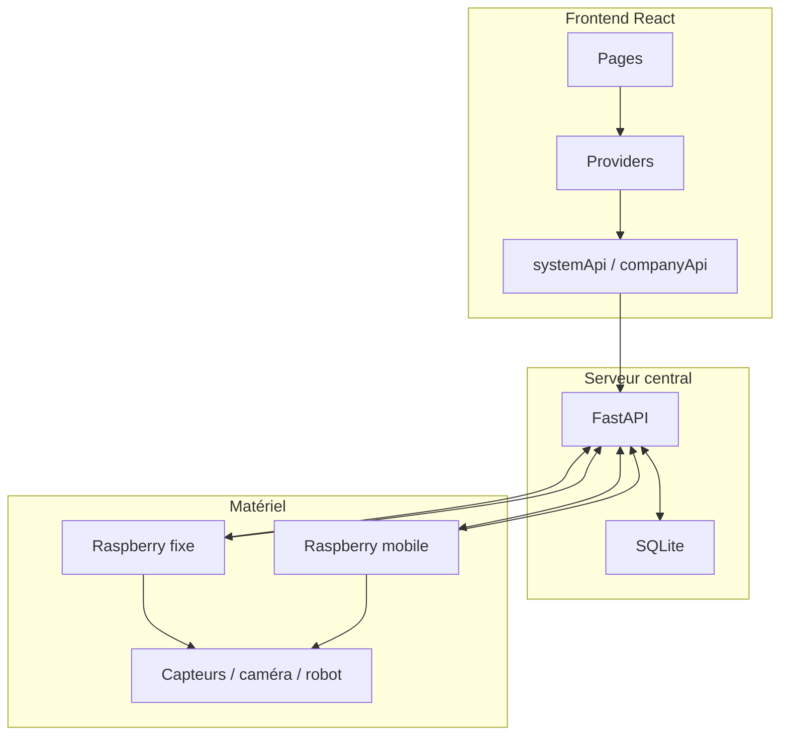

---

# 84. Résumé des responsabilités par fichier

| Fichier | Responsabilité |
|---|---|
| `main.tsx` | démarre React |
| `App.tsx` | définit les routes |
| `dashboard.ts` | types particulier |
| `company.ts` | types entreprise |
| `systemApi.ts` | HTTP particulier |
| `companyApi.ts` | HTTP entreprise |
| `system-context.ts` | contrat contexte particulier |
| `SystemProvider.tsx` | état + logique particulier |
| `company-context.ts` | contrat contexte entreprise |
| `CompanyProvider.tsx` | état + logique entreprise |
| `useSystem.ts` | accès au SystemProvider |
| `useCompany.ts` | accès au CompanyProvider |
| `UserLayout.tsx` | navigation particulier |
| `CompanyLayout.tsx` | navigation entreprise + health gate |
| `NetworkIncidentModal.tsx` | gestion popup réseau |
| `CameraViewer.tsx` | flux + capture + activation caméra |
| `EquipmentControl.tsx` | carte équipement |
| `MetricCard.tsx` | KPI réutilisable |
| `LoginPage.tsx` | choix prototype |
| `UserDashboardPage.tsx` | synthèse logement |
| `UserAlertsPage.tsx` | alerte utilisateur |
| `UserCamerasPage.tsx` | caméras fixes |
| `UserRobotPage.tsx` | robot caméra |
| `UserEquipmentPage.tsx` | parc matériel |
| `UserEquipmentDetailPage.tsx` | détail matériel |
| `UserStatisticspage.tsx` | statistiques |
| `UserHistoryPage.tsx` | historique |
| `CompanyDashboardPage.tsx` | synthèse centre |
| `CompanyAlertsPage.tsx` | traitement des alertes |
| `CompanyCustomersPage.tsx` | clients + installations |
| `CompanySupportPage.tsx` | support |
| `CompanyInterventionsPage.tsx` | terrain |
| `CompanyInfrastructurePage.tsx` | topologie réseau, Raspberry, liaisons et diagnostic technique |
| `CompanyAuditPage.tsx` | audit |
| `vite.config.ts` | proxy + serveur dev |
| `.env.local` | cible FastAPI |

---

# 85. Définition de réussite pour lundi

L’intégration est considérée réussie si le scénario suivant fonctionne sans données fictives :

```text
1. Raspberry fixe et mobile démarrent
2. heartbeats reçus
3. React voit les deux contrôleurs
4. `/entreprise/infrastructure` affiche les deux Raspberry et leurs composants
5. un débranchement/rebranchement fait évoluer ONLINE/OFFLINE visuellement
6. admin crée un client
7. admin crée un site
8. admin rattache les Raspberry
9. fiche client affiche les appareils
10. un vrai mouvement est détecté
11. FastAPI crée l'événement
12. FastAPI crée CompanyAlert
13. React entreprise voit l'alerte
14. opérateur la prend en charge
15. caméra réelle s'ouvre
16. capture réelle fonctionne
17. robot reçoit au moins FORWARD puis STOP
18. action apparaît dans la timeline
19. action apparaît dans l'audit
```

Le scénario complet démontre la chaîne :

```text
CAPTEUR
  ↓
RASPBERRY
  ↓
RÉSEAU
  ↓
FASTAPI
  ↓
SQLITE
  ↓
REACT ENTREPRISE
  ↓
ACTION OPÉRATEUR
  ↓
FASTAPI
  ↓
RASPBERRY
```

---

# 86. Conclusion

Le frontend est organisé autour de deux principes :

### 1. Centralisation réseau

```text
React ↔ FastAPI ↔ Raspberry
```

et jamais :

```text
React ↔ Raspberry
```

### 2. Séparation des responsabilités

```text
Types
  ↓
Services HTTP
  ↓
Providers
  ↓
Hooks
  ↓
Pages / composants
```

Cette structure permet :

- de remplacer plus tard le polling par WebSocket ;
- d’ajouter une vraie authentification ;
- de gérer plusieurs clients et plusieurs sites ;
- de rattacher dynamiquement plusieurs Raspberry ;
- de conserver la logique matérielle hors du frontend ;
- de tracer les opérations du centre de surveillance ;
- de faire évoluer le backend sans réécrire toutes les pages React.

---

## Prochaine documentation prévue

Après validation de ce README, un second fichier devra être rédigé pour les camarades responsables des Raspberry :

```text
RASPBERRY_INTEGRATION.md
```

Il décrira exactement, fichier par fichier :

- les fonctions à ajouter ;
- les endpoints locaux à exposer ;
- les JSON à envoyer ;
- les noms de composants obligatoires ;
- le heartbeat ;
- les événements ;
- le flux caméra ;
- les screenshots ;
- les commandes robot ;
- les erreurs à gérer ;
- les tests `curl` à effectuer avant le branchement collectif.

Ensuite, le backend `main.py` pourra être découpé proprement en modules :

```text
routers/
services/
models/
database.py
config.py
```

sans changer le contrat HTTP utilisé par le frontend.
